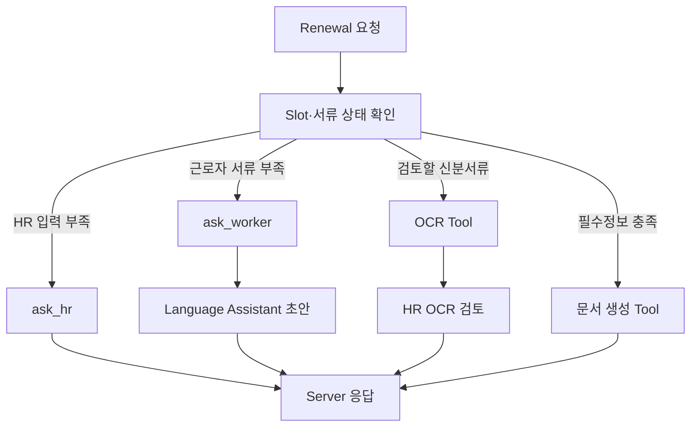

# FOWOCO AI

<p align="center">
  <a href="https://github.com/fowoco/ai/actions/workflows/deploy.yml"></a>
</p>

E-9 외국인근로자를 고용한 사업장의 재계약·체류기간 연장 업무를 분석하고,
담당자가 검토할 안내문과 문서 초안을 만드는 FastAPI 기반 AI Runtime입니다.

> AI는 HR 업무를 대신 승인하거나 제출하지 않습니다. AI가 만드는 것은 **분석 결과와
> 초안**이며, 사용자·사업장 권한, 공식 업무 상태, 파일 저장, 승인과 감사 이력은
> FOWOCO Server가 통제합니다.

## 프로젝트 한눈에 보기

| 영역 | 구현 내용 | 실제 Provider 조건 |
| --- | --- | --- |
| Intent 분석 | BERT 우선 분류, Guardrail, 필요 시 A.X 보완, PLAN 결정 재사용 | Hugging Face 모델과 토큰을 설정해야 실제 모델 사용 |
| Renewal Agent | LangGraph로 HR 질문·근로자 요청·OCR·문서 생성 분기 | Server가 검증된 Worker·Company·Task Context 제공 |
| Language Assistant | 표준 한국어·쉬운 한국어·15개 대상 언어 안내 초안과 검토 경고 | OpenAI 호환 LLM, 선택적으로 Qdrant 필요 |
| OCR | 여권·외국인등록증 Template OCR 결과 정규화 | CLOVA OCR URL·Secret 필요 |
| 문서 처리 | 재갱신 HWPX 초안 4종, HWP/HWPX 검사·편집·변환 | 변환별 Java·rhwp·LibreOffice 실행환경 필요 |
| 안전 처리 | 누락정보·낮은 신뢰도·Provider 실패를 HR 검토 상태로 반환 | 자동 승인·자동 발송·업무 DB 직접 수정 금지 |

환경변수를 설정하지 않은 선택 기능은 Stub 또는 명시적인 `503`으로 동작합니다.
따라서 “코드가 존재함”과 “실제 Provider가 활성화됨”을 구분해 확인해야 합니다.

## 저장소 경계

FOWOCO는 모델이 업무 시스템을 직접 조작하지 않도록 저장소별 책임을 분리합니다.

| 저장소 | 소유하는 것 | 소유하지 않는 것 |
| --- | --- | --- |
| `ai` | Prompt, 모델 라우팅, Agent 판단, OCR·언어·문서 Tool 조합 | 로그인, 사업장 권한, 공식 업무 상태, 감사로그 |
| `server` | 인증·tenant, Worker·Task·Case, 승인, FileStorage, 실행 이력 | Prompt와 Provider SDK, 모델 내부 판단 |
| `knowledge` | Intent·Workflow·Slot의 canonical ID, 공식 근거, 평가 데이터 | 실행 상태와 사용자 권한 |
| `client` | HR·근로자 화면, 질문·검토·승인 입력 | AI 결과의 최종 확정 |

AI는 운영 DB에 SQL을 만들거나 직접 접근하지 않습니다. PLAN에서 필요한
`requestedFieldKeys`를 반환하면 Server가 allow-list와 `company_id` 권한을 검사해
필요한 값만 ANALYZE 또는 Renewal 요청에 보충합니다. `app/db`는 로컬·테스트용
인메모리 Adapter이며 운영 업무 데이터의 기준이 아닙니다.

## Tool·Agent·Server 통제

기능 이름이 “Agent”라는 이유로 모든 결정을 모델에 맡기지 않습니다.

| 구분 | 예시 | 책임 |
| --- | --- | --- |
| Tool | CLOVA OCR 호출, Qdrant 검색, HWP/HWPX 생성·변환 | 정해진 입력을 실행하고 구조화된 결과 반환 |
| Agent 판단 | Intent 후보, 누락 Slot, 다음 분기, 안내문 초안 | 선택 이유·결과·경고를 응답하되 상태를 직접 확정하지 않음 |
| Server 통제 | tenant 조회, Workflow ID 검증, HR 승인, Task 전이, 파일·감사 저장 | AI 결과를 신뢰하기 전에 재검증하고 실제 업무 반영 여부 결정 |

이 경계 덕분에 Provider가 실패하거나 모델 판단이 바뀌어도 승인·증빙·업무 상태는
Server에서 일관되게 유지됩니다.

## 대표 실행 흐름

```text
HR 원문 입력
→ Server가 AiRun 생성
→ AI PLAN: 대표 Intent·Workflow와 필요한 field 결정
→ Server가 PLAN 결정을 저장하고 허용된 Context만 조회
→ AI ANALYZE: 저장된 결정을 재사용해 질문 또는 Candidate 생성
→ Server가 Workflow 일치 여부를 검증
→ HR이 Candidate 채택
→ Server가 Renewal 실행 요청
→ Agent가 HR 질문 / 근로자 요청 / OCR / 안내 / 문서 생성 분기
→ Server가 초안과 파일을 저장
→ HR 검토·승인 후에만 다음 업무 진행
```

### PLAN과 ANALYZE를 나눈 이유

PLAN은 “무슨 업무이며 어떤 정보가 필요한가”를 결정하고, ANALYZE는 Server가 보충한
정보로 “어떤 업무카드를 제안할 것인가”를 만듭니다. ANALYZE가 Intent 모델을 다시
호출하지 않도록 `plannedIntent`와 `plannedWorkflowId`를 재사용해 결과 불일치와
중복 모델 호출을 줄였습니다.

- `detectedIntent`: `EXPIRY_RENEWAL`처럼 사용자의 업무 의도
- `workflowId`: `WF-STY-001`처럼 Knowledge가 정의한 실행 절차 ID
- `confidence`: 모델이 확률을 제공할 때만 사용하며, A.X처럼 제공하지 않으면 `null`
- `evidence`: 모델이 근거 구간을 제공할 때만 사용하며 없으면 `null`

상세 계약은 [업무 분석 계약](docs/analyses-contract.md)과
[재갱신 Workflow 계약](docs/workflows-contract.md)을 기준으로 합니다.

### Renewal Agent 분기



Provider 오류나 번역 검토가 필요한 경우 근로자용 임시 문장을 만들지 않습니다.
`guideReviewRequired`, `guideFailureCode`, `workerRequestMessage=null`을 반환해 Server가
HR 검토 경로로 전환하게 합니다. 생성 문서도 자동 승인·발송하지 않습니다.

## 주요 API

| Method | Path | 호출 주체·역할 |
| --- | --- | --- |
| `POST` | `/internal/v1/analyses` | Server가 PLAN·ANALYZE 실행 |
| `GET` | `/internal/v1/intent/status` | Intent 설정·모델 가용성 확인 |
| `GET` | `/internal/v1/intent/readiness` | 모델 warmup 완료 여부 확인 |
| `POST` | `/internal/v1/workflows/renewal/run` | Server가 Renewal Agent 실행 |
| `POST` | `/internal/v1/ocr/worker-documents/{worker_document_id}` | Server가 선택한 신분서류 OCR 실행 |
| `POST` | `/internal/v1/language-assistant` | 구조화된 근로자 안내 초안 생성 |
| `GET` | `/api/v1/documents/capabilities` | 사용 가능한 문서 처리 기능 조회 |
| `POST` | `/api/v1/documents/inspect` | HWP/HWPX 구조 검사 |
| `POST` | `/api/v1/documents/edit` | 승인된 필드 편집 적용 |
| `POST` | `/api/v1/documents/generate` | 재갱신 양식 초안 생성 |
| `POST` | `/api/v1/documents/convert` | 지원 형식 간 변환 |

로컬 Swagger는 애플리케이션 실행 후 [http://localhost:8000/docs](http://localhost:8000/docs)에서
확인합니다. 분석·Intent 상태·Renewal·OCR 같은 Server 전용 운영 호출에는 Server와
공유한 Bearer Token을 사용합니다.

## 코드 구조

```text
app/
├── main.py                 FastAPI 진입점
├── api/                    HTTP 요청·응답 계약과 인증
├── agents/
│   ├── intent/             BERT·A.X 분류와 Guardrail
│   ├── language/           안내문 생성·검증
│   └── workflow_graph/     Renewal LangGraph 오케스트레이션
├── ocr/                    CLOVA OCR Adapter와 결과 정규화
├── documents/              HWP·HWPX 생성·검사·편집·변환
├── db/                     로컬·테스트용 인메모리 Port 구현
└── core/                   설정과 공통 기반

hwp-editor/                 HWPX 필드 탐색·승인 편집·시각 검증 MCP
docs/                       API·Provider·운영 계약
tests/                      단위·계약·통합 테스트
```

## 로컬 검증

```bash
python -m venv .venv
source .venv/bin/activate
pip install -e ".[dev]"
cp .env.example .env
uvicorn app.main:app --reload --port 8000
```

별도 터미널에서 다음을 실행합니다.

```bash
pytest
ruff check app tests
```

실제 기능이 필요할 때만 선택 의존성과 Secret을 추가합니다.

```bash
pip install -e ".[intent]"              # Hugging Face Intent
pip install -e ".[language-retrieval]"  # Qdrant 검색
docker compose up --build                 # AI + Qdrant
```

실제 API Key·HF Token·CLOVA Secret은 `.env` 또는 배포 Secret에만 넣고 Git에
커밋하지 않습니다. 전체 환경변수 이름과 opt-in 조건은 [.env.example](.env.example)을
확인합니다.

## 팀 협업과 기여

| 개발자 | 주 담당 | 주요 구현 |
| --- | --- | --- |
| 이휘 | Agent Workflow | 메인 그래프, Supervisor, Renewal Workflow, Server·MCP 연결 기반 |
| 박태정 | Language Assistant·HWPX MCP | 다국어 안내, EPS 검색·생성 Pipeline, HWPX 편집·검증 |
| 안주현 | OCR·문서 매핑 | CLOVA OCR, 여권·외국인등록증 결과 정규화, 문서 필드 연결 |
| 최현준 [`@hywznn`](https://github.com/hywznn) | Server–AI 계약·E2E 통합 | Intent와 canonical Workflow ID 분리, Knowledge A.X Prompt·PLAN 결정 재사용, OCR 계약 교정, Knowledge 0.3 Slot 반영, 체류만료 예외 Workflow, 실패 시 HR 검토 전환 |

### `@hywznn` 교차 저장소 기여 하이라이트

현준님은 Server에서 AI 결과를 통제된 HR Workflow로 연결하면서, AI 저장소의 계약과
실행 결과가 실제 Server 흐름과 맞지 않는 지점을 직접 수정·검증했습니다.

- [`#19`](https://github.com/fowoco/ai/pull/19): Intent와 `WF-STY-001` 같은 canonical Workflow ID를 분리
- [`#23`](https://github.com/fowoco/ai/pull/23): OCR 날짜 파싱 실패 시 필드와 confidence 계약을 일치
- [`#33`](https://github.com/fowoco/ai/pull/33): Knowledge A.X Prompt를 연결하고 PLAN 결정을 ANALYZE에서 재사용
- [`#44`](https://github.com/fowoco/ai/pull/44): 안내 생성 실패를 자동 발송이 아닌 HR 검토로 전환
- [`#52`](https://github.com/fowoco/ai/pull/52): Knowledge 0.3.0 Workflow·Slot 계약을 Agent에 반영
- [`#57`](https://github.com/fowoco/ai/pull/57): 체류기간 만료 경과를 별도 검토 Workflow로 연결

세부 변경은 [`@hywznn`의 병합 PR](https://github.com/fowoco/ai/pulls?q=is%3Apr+is%3Amerged+author%3Ahywznn)에서
코드와 테스트 단위로 확인할 수 있습니다. OCR·Language·HWPX의 원래 담당 영역을
대체했다는 의미가 아니라, 저장소 사이의 계약과 대표 시나리오를 완성한 교차 기여를
명확히 기록한 것입니다.

## 주요 문서

| 찾는 내용 | 문서 |
| --- | --- |
| Server 연결과 인증 | [AI Runtime Handshake](docs/ai-runtime-handshake.md) |
| PLAN·ANALYZE 계약 | [Analyses Contract](docs/analyses-contract.md) |
| Renewal Agent 계약 | [Workflows Contract](docs/workflows-contract.md) |
| Slot 재보충 | [Slot Refill Contract](docs/slot-refill-contract.md) |
| Language Assistant 운영 | [Language Assistant Operations](docs/language-assistant-operations.md) |
| Language 품질 기준 | [Language Assistant Baseline](docs/evaluations/language-assistant-baseline.md) |
| CLOVA OCR 연결 | [CLOVA OCR Integration](docs/clova-ocr-integration.md) |
| HWP·HWPX 처리 | [Document Engine](app/documents/README.md) |
| HWPX MCP | [HWP Editor](hwp-editor/README.md) |
