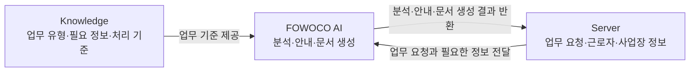
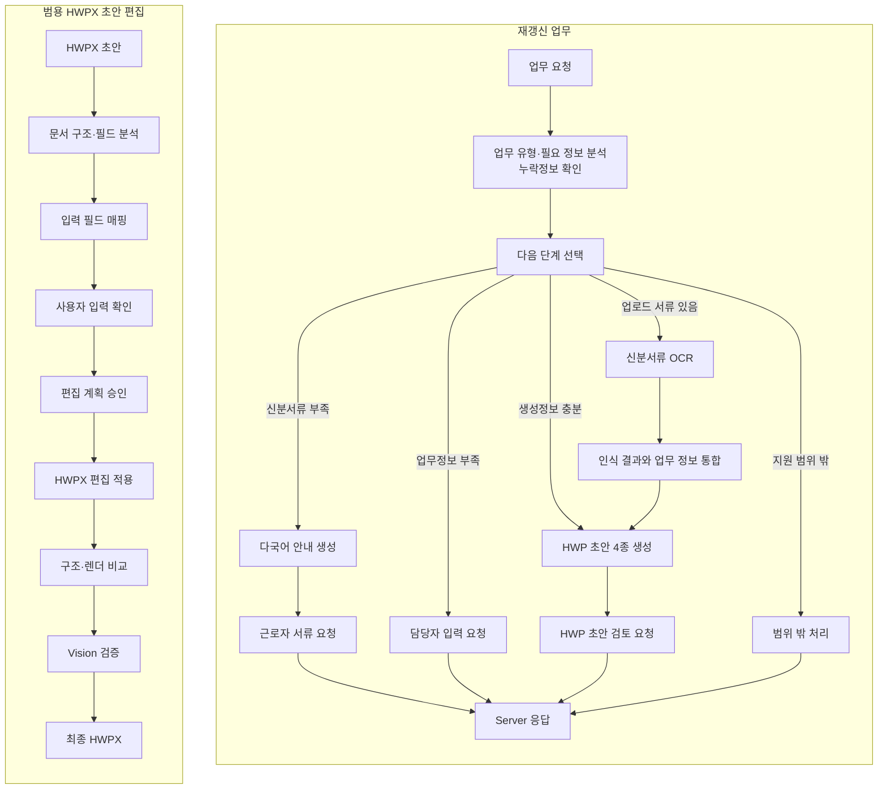
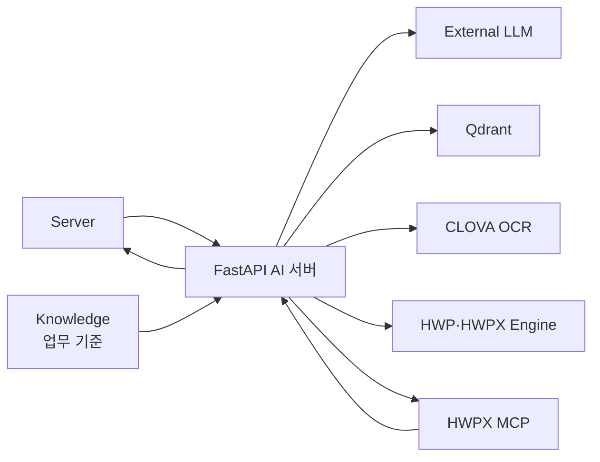

# FOWOCO AI

<p align="center">
  <a href="https://github.com/fowoco/ai/actions/workflows/deploy.yml"></a>
</p>

E-9 외국인근로자 고용 업무를 돕는 AI 서버입니다.

담당자가 입력한 문장을 이해하고, 재계약·체류기간 연장에 필요한 다음 업무를 안내합니다.<br>
여권·외국인등록증의 정보를 읽어 HWP 문서 초안을 만들고, 외국인근로자에게 필요한
안내문을 쉬운 한국어와 15개 언어로 제공합니다.

## AI Team

| 담당 | 담당 영역 | 주요 작업 |
| --- | --- | --- |
| 이휘 | AI 워크플로 설계·통합 | 메인 그래프, 슈퍼바이저, 재갱신 워크플로, Server·MCP 연동 |
| 박태정 | Language Assistant·HWPX MCP | 다국어 안내, EPS 검색·생성 파이프라인, HWPX MCP 설계·구현 |
| 안주현 | OCR·문서 매핑 | 여권·외국인등록증 인식, CLOVA 연동, 인식 정보 정리, OCR 결과·문서 입력 칸 연결 |

## AI 주요 기능

| AI 주요 기능 | 결과 |
| --- | --- |
| 자연어 요청에서 업무 의도와 필요 정보 분석 | 업무 유형·입력값·누락정보 |
| 재갱신 업무 흐름과 분기 실행 | 다음 행동·진행 상태 |
| 표준 한국어·쉬운 한국어·15개 언어 생성 | 근로자 안내문·검토 경고 |
| CLOVA OCR로 신분서류 인식 | 정리된 여권·외국인등록증 정보 |
| 재갱신 필수 양식에 업무 데이터 자동 기입 | HWP 문서 초안 4종 |
| HWP·HWPX 검사·편집·변환 | 문서 분석 결과·변환 파일 |
| HWPX MCP 승인 편집·시각 비교 | 검증된 최종 HWPX·검토 요청 |

## Server·Knowledge 연결



- Analyses: BERT/A.X Intent + PLAN 결정 재사용 + Catalog 필수슬롯·Knowledge 모호표현 ([docs/analyses-contract.md](docs/analyses-contract.md))
- Workflows: 재갱신 LangGraph — 슈퍼바이저 → 안내문(태정) / OCR(주현) / 초안 4종 — [docs/workflows-contract.md](docs/workflows-contract.md)
- Language Assistant: 외국인근로자 15개 언어 번역, 쉬운 한국어 변환 및 표준 한국어 생성 — [docs/contracts/language-assistant-http-request.schema.json](docs/contracts/language-assistant-http-request.schema.json)
- 최종 흐름도: [app/agents/workflow_graph/README.md](app/agents/workflow_graph/README.md)

## 문서 API

문서 API는 책임별로 분리한다.

```text
GET  /api/v1/documents/templates
GET  /api/v1/documents/templates/{template_id}
POST /api/v1/documents/inspect
POST /api/v1/documents/edit
POST /api/v1/documents/generate
POST /api/v1/documents/generate/from-txt
POST /api/v1/documents/convert
| 연결 대상 | AI로 전달 | AI에서 반환 |
| --- | --- | --- |
| Knowledge | 업무 유형, 필요한 정보, 처리 순서와 공식 근거 | 업무 분석과 안내문에 반영된 기준 |
| Server | 담당자의 요청, 근로자·사업장 정보, 보유 문서 | 분석 결과, 다음 업무, 안내문, 인식 결과, HWP 초안 생성 결과 |

## 현재 구현 기준

| 영역 | 현재 확인할 수 있는 내용 |
| --- | --- |
| 업무 분석 | 재갱신 업무 유형, 필수 정보, 누락·모호한 표현 확인 |
| 업무 흐름 | 규칙 또는 AI를 이용한 다음 단계 선택, 안내·OCR·문서 생성 |
| 다국어 안내 | 표준·쉬운 한국어와 15개 언어 안내, 관련 EPS 문장 검색 |
| 신분서류 인식 | 여권·외국인등록증 정보 추출, 항목 정리와 정확도 제공 |
| 문서 처리 | 재갱신 HWP 초안 4종 생성, HWP·HWPX 검사·편집·변환 |
| HWPX 편집 | 입력 칸 탐색, 편집 승인, 원본·결과 화면 비교와 최종본 생성 |
| 실행 환경 | FastAPI, Qdrant, HWP MCP의 Docker Compose 구성 |

## 전체 흐름



### 재갱신 요청 분기

| 조건 | 처리 | 결과 |
| --- | --- | --- |
| 신분서류 부족 | 다국어 안내 생성 | 근로자 서류 요청 |
| 계약·근무정보 부족 | 담당자 입력 요청 | 추가 입력이 필요한 항목 |
| 인식할 신분서류가 있음 | 서류 정보 추출 후 HWP 생성 | HWP 초안 생성 결과 |
| 생성정보 충분 | HWP 초안 바로 생성 | HWP 초안 생성 결과 |
| 지원 범위 밖 | 워크플로 종료 | 범위 밖 안내 |

문서 생성 결과에는 각 초안의 생성 여부, 파일 형식, 저장 위치와 입력된 항목이 포함됩니다.<br>
문서를 만들지 못한 경우에도 입력값을 보존해 원인을 확인하고 다시 처리할 수 있습니다.

HWPX MCP는 양식 종류와 관계없이 기존 HWPX 초안에서 입력할 칸을 찾아냅니다.<br>
사용자가 내용을 확인하고 승인하면 문서에 값을 채우고, 원본과 결과 화면을 비교한 뒤 최종본을 제공합니다.

## 구성·연결

| 구성 | 입력 | 처리 결과 | 연결 |
| --- | --- | --- | --- |
| 언어 처리 | 업무 요청·기본 정보 | 업무 유형·필요 정보·안내문 | 다음 단계 선택에 사용 |
| OCR 처리 | 업로드 신분서류 | 여권·외국인등록증 정보 | 문서 생성에 사용 |
| 문서 생성 | 업무 정보·OCR 결과 | 양식별 입력값·HWP 초안 4종 | 재갱신 결과로 반환 |
| HWPX MCP | 편집할 HWPX 초안·사용자 입력 | 필드 매핑·승인 편집·시각 검증 | 최종 HWPX로 반환 |

재갱신 문서는 `업무 정보 + OCR 결과 → 양식의 입력 칸 연결 → HWP 초안 4종` 순서로
만듭니다.<br>
HWPX 편집은 `문서 구조 분석 → 입력 칸 찾기 → 사용자 확인 → 승인된 내용 적용` 순서로
진행합니다.

## 아키텍처



Server는 업무 정보를 전달하고 결과를 받습니다. Knowledge는 업무 기준을 제공하며,
LLM은 문장 생성, Qdrant는 관련 문장 검색, CLOVA OCR은 신분서류 인식을 담당합니다.
HWP·HWPX Engine과 HWPX MCP는 문서 생성·편집과 결과 검증을 처리합니다.

```text
app/
├── main.py               FastAPI 진입점
├── api/                  API·요청/응답 계약
├── agents/               분석·워크플로·다국어 처리
├── ocr/                  CLOVA OCR 연결·인식 정보 정리
├── documents/            HWP·HWPX 생성·편집·변환
├── db/                   업무 데이터 조회·저장 인터페이스
└── core/                 환경설정·공통 기반

hwp-editor/
├── src/hwp_mcp/          HWPX 분석·필드 매핑·검증
└── tests/                MCP 워크플로 검증

docs/                     API·연동·운영 문서
scripts/                  실행·모델·색인 도구
tests/                    AI 서버 테스트
```

`api`가 요청을 받고 `agents`가 흐름을 결정합니다.<br>
OCR과 문서 처리는 각각 `ocr`, `documents`가 실행하며, 범용 HWPX 편집·검증은 `hwp-editor`가 담당합니다.

## 주요 문서

| 구분 | 문서 |
| --- | --- |
| API | [API 안내](app/api/README.md) · [API 화면](http://localhost:8000/docs) |
| AI 연동 | [Server 연결](docs/ai-runtime-handshake.md) · [업무 분석 규격](docs/analyses-contract.md) · [재갱신 흐름 규격](docs/workflows-contract.md) |
| 다국어·OCR | [다국어 안내 운영](docs/language-assistant-operations.md) · [품질 평가](docs/evaluations/language-assistant-baseline.md) · [CLOVA OCR 연결](docs/clova-ocr-integration.md) |
| 문서 처리 | [HWP·HWPX 처리](app/documents/README.md) · [HWPX 편집·검증](hwp-editor/README.md) |
