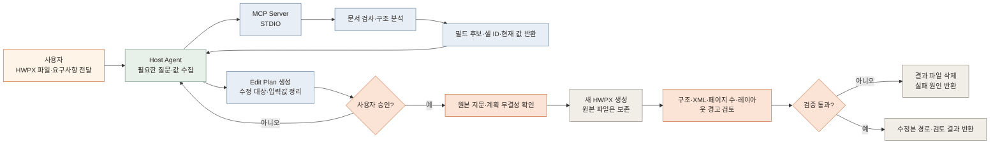

# HWPX Editor MCP Server

로컬 HWPX 문서를 검사하고, 표·셀 구조를 분석하고, 본문 텍스트를 추출하고, 정확한 문자열을 새 파일에 치환하는 학습용 MCP Server입니다.

## 지원 범위

- 지원: `.hwpx` 검사, 본문 텍스트 추출, 한 개의 `<hp:t>` 안에서 일치하는 문자열 치환
- 추가: 문단·표·셀·이미지와 사용자 확인용 입력 후보를 반환하는 구조 Manifest
- 추가: 확인된 셀 여러 개에 값을 붙여 새 HWPX로 저장
- 추가: `rhwp` CLI를 통한 페이지별 SVG 렌더링과 Debug Overlay
- 추가: 원본 레이아웃 경고는 기준선으로 보존하고 수정 후 신규 경고만 차단
- 추가: 두 HWPX 버전의 구조·SVG 페이지 비교
- 추가: 승인 대기 Edit Plan 생성과 승인 후 적용·결과 검토
- 추가: 날짜·전화번호 변환안을 별도로 확인하는 정규화 Tool
- 제한: 원본 덮어쓰기 금지, 허용 작업 폴더 밖 접근 금지, 출력 파일 재검증
- 제한: `rhwp`는 `RHWP_COMMAND`로 지정하며 렌더링 출력 폴더는 새 경로여야 함
- 미지원: `.hwp` 바이너리 직접 편집, 표·이미지·스타일의 의미 있는 편집, 원격 HTTP 배포·인증

HWP와 HWPX는 내부 구조가 다릅니다. HWPX는 ZIP/XML 기반이라 1차 대상으로 삼았고, HWP는 변환 어댑터를 별도 검토합니다.

## 워크플로우

현재 구현은 원본을 보존하면서, 분석 → 수정 계획 → 사용자 승인 → 새 파일 생성 → 결과 검증 순서로 동작합니다.



대화 상태와 사용자 인터뷰는 Host Agent가 담당합니다. MCP Server는 문서 분석, 수정 계획 생성, 승인된 계획의 적용, 결과 검증을 담당합니다.

## 실행

Python 3.10+과 `uv`가 필요합니다.

```bash
cd /Users/parktaejung/Desktop/workspace/LLM\ Wiki/mcp/hwp-editor
uv sync
HWP_MCP_ROOT="/path/to/allowed/documents" uv run hwp-editor-mcp
```

`HWP_MCP_ROOT`를 지정하지 않으면 Server를 실행한 현재 폴더를 작업 루트로 사용합니다.

FastAPI Control Plane은 같은 작업 루트를 사용합니다.

```bash
HWP_MCP_ROOT="/path/to/allowed/documents" uv run hwp-editor-api
```

현재 HTTP 범위는 `/health`, `/documents/analyze`, `/plans/create`, `/plans/apply`입니다. 파일 업로드·세션 저장·웹 인증은 아직 추가하지 않았습니다.

## MCP Client 등록 예시

```json
{
  "mcpServers": {
    "hwp-editor": {
      "command": "uv",
      "args": [
        "run",
        "--directory",
        "/Users/parktaejung/Desktop/workspace/LLM Wiki/mcp/hwp-editor",
        "hwp-editor-mcp"
      ],
      "env": {
        "HWP_MCP_ROOT": "/path/to/allowed/documents",
        "RHWP_COMMAND": "rhwp"
      }
    }
  }
}
```

## 테스트

```bash
uv run pytest
```

## Tool

| Tool | 동작 |
|---|---|
| `inspect_document` | 형식·크기·구역·필수 파트 확인 |
| `extract_text` | 구역·문단별 본문 텍스트 추출 |
| `analyze_document` | 문단·표·셀·이미지 후보와 안정적인 대상 ID 반환 |
| `render_document` | `rhwp`로 페이지별 SVG와 Debug Overlay 생성 |
| `compare_document_versions` | 문단·셀 구조와 페이지별 SVG SHA-256 비교 |
| `fill_cells` | 확인된 셀 여러 개에 값을 입력하고 새 `.hwpx`로 저장 후 재검증 |
| `create_edit_plan` | 셀 변경 계획을 만들고 승인 전 상태로 반환 |
| `apply_edit_plan` | 승인·원본 지문·계획 무결성 확인 후 생성하고 선택적으로 결과 검토 |
| `normalize_field_value` | 날짜·전화번호 변환안을 반환하고 자동 적용하지 않음 |
| `replace_text` | 정확한 문자열을 새 `.hwpx` 파일에 치환 후 재검증 |
| `validate_document` | ZIP/XML·필수 파트·구역 파일 검증 |

## FastAPI Endpoint

| Endpoint | 동작 |
|---|---|
| `GET /health` | Control Plane 상태 확인 |
| `POST /documents/analyze` | 허용 루트의 HWPX 구조 분석 |
| `POST /plans/create` | 승인 대기 Edit Plan 생성 |
| `POST /plans/apply` | 승인·검토 후 새 HWPX 생성 |

## 다음 단계

1. 실제 HWPX 샘플 3종(단순 문서·표 포함·이미지 포함)으로 렌더링 검증
2. PNG 렌더링이 가능해지면 SVG 비교를 픽셀 diff로 보강
3. 날짜·전화번호 정규화와 다중 필드 입력 계획을 추가
4. 표 편집은 OWPML 구조와 참조 관계를 별도 학습한 뒤 설계
5. HWP는 직접 편집이 아닌 HWP→HWPX 변환 어댑터부터 실험
6. 로컬 검증이 끝난 뒤에만 Streamable HTTP·인증을 검토

## 근거

- [MCP Architecture](https://modelcontextprotocol.io/docs/learn/architecture)
- [Official MCP Python SDK](https://github.com/modelcontextprotocol/python-sdk)
- [한컴 HWPX 포맷 구조](https://tech.hancom.com/한-글-문서-파일-형식-hwpxformat/)
- [한컴 HWP 포맷 구조](https://tech.hancom.com/한-글-문서-파일-형식-hwp-포맷-구조-살펴보기/)
- [한컴 공식 OWPML 모델](https://github.com/hancom-io/hwpx-owpml-model)
