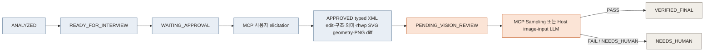

# HWPX Editor MCP Server

로컬 HWPX 문서를 XML·렌더 결과로 분석하고, 승인된 typed edit를 검증한 뒤 Vision PASS 결과만 최종화하는 학습용 MCP Server입니다.

## 지원 범위

- 지원: `.hwpx` 검사, 본문 텍스트 추출, 한 개의 `<hp:t>` 안에서 일치하는 문자열 치환
- 추가: 문단·표·셀·이미지와 사용자 확인용 입력 후보를 반환하는 구조 Manifest
- 추가: `text/grid/checkbox/date/amount` typed operation과 정확한 anchor 사전조건
- 추가: 문서 hash 기반 workspace, 전용 SQLite workflow state, 실패 attempt 보존
- 추가: `rhwp` CLI SVG의 `cell-clip`·텍스트 bbox를 파싱한 field spatial mapping
- 추가: 원본 레이아웃 경고는 기준선으로 보존하고 수정 후 신규 경고만 차단
- 추가: 두 HWPX 버전의 구조·SVG cell 이동·텍스트 overflow 비교
- 추가: MCP 사용자 elicitation과 plan hash에 결합된 HMAC 서명 승인 receipt
- 추가: 모든 field disposition을 강제하는 Edit Plan과 Vision 최종화 게이트
- 추가: MCP sampling으로 원본·수정·diff PNG를 실제 Vision 판정
- 추가: Sampling 미지원 Host에 실제 PNG bytes와 signed delivery를 전달하는 범용 Vision 제출
- 추가: 날짜·전화번호 변환안을 별도로 확인하는 정규화 Tool
- 제한: 원본 덮어쓰기 금지, 허용 작업 폴더 밖 접근 금지, 출력 파일 재검증
- 제한: `rhwp`는 `RHWP_COMMAND`로 지정하며 렌더링 출력 폴더는 새 경로여야 함
- 미지원: `.hwp` 바이너리 직접 편집, 전자서명 적용, 다중 MCP 서버 인스턴스
- 제한: Sampling과 Host 이미지 입력을 모두 사용할 수 없으면 `NEEDS_HUMAN`

HWP와 HWPX는 내부 구조가 다릅니다. HWPX는 ZIP/XML 기반이라 1차 대상으로 삼았고, HWP는 변환 어댑터를 별도 검토합니다.

## 워크플로우

원본은 `<safe-stem>-<hash>/original.hwpx`로 복사합니다. 수정본은 attempt에 남고, `VERIFIED_FINAL` 전에는 `final/`에 HWPX가 없습니다.



대화 상태와 사용자 인터뷰는 Host Agent가 담당합니다. MCP Server는 문서 분석, 수정 계획 생성, 승인된 계획의 적용, 결과 검증을 담당합니다.

## 실행

Python 3.10+과 `uv`가 필요합니다.

```bash
cd /Users/parktaejung/Desktop/workspace/LLM\ Wiki/mcp/hwp-editor
uv sync
python3 -c 'import base64,secrets; print(base64.b64encode(secrets.token_bytes(32)).decode())'

export HWP_MCP_ROOT="/path/to/allowed/documents"
export HWP_MCP_ACTIVE_SIGNING_KEY_ID="v1"
export HWP_MCP_SIGNING_KEYS='{"v1":"<위 명령으로 생성한 base64 키>"}'
uv run hwp-editor-mcp
```

`HWP_MCP_ROOT`를 지정하지 않으면 Server를 실행한 현재 폴더를 작업 루트로 사용합니다.
전용 DB는 기본적으로 `$HWP_MCP_ROOT/.hwp-mcp/state.sqlite3`에 생성됩니다.
다른 위치를 쓰려면 `HWP_MCP_STATE_DB`에 `HWP_MCP_ROOT` 내부 경로를 지정합니다.

이 구성은 **한 번에 하나의 MCP 서버 인스턴스**를 실행하는 독립 배포를 지원합니다.
SQLite와 HMAC key ring이 함께 있어야 기존 승인과 workflow를 재시작 후에도 검증할
수 있습니다. `.hwp-mcp/state.sqlite3`, 작업 workspace, `HWP_MCP_SIGNING_KEYS`를
함께 백업하세요. 키 원문은 DB나 receipt에 저장되지 않습니다.
SQLite는 WAL 모드를 사용하므로 백업할 때 MCP 서버를 먼저 종료해야 합니다.
실행 중 백업이 필요하면 `state.sqlite3`, `state.sqlite3-wal`,
`state.sqlite3-shm`을 같은 시점의 묶음으로 보존하거나 SQLite online backup을
사용하세요.

FastAPI Control Plane은 같은 작업 루트를 사용합니다.

```bash
HWP_MCP_ROOT="/path/to/allowed/documents" uv run hwp-editor-api
```

현재 HTTP 범위는 `/health`, `/documents/analyze`, `/plans/create`, `/plans/apply`입니다. 사용자 승인은 MCP `approve_edit_plan`에서만 생성하며 HTTP apply는 이미 승인 receipt가 있는 plan만 실행합니다. 파일 업로드·세션 저장·웹 인증은 아직 추가하지 않았습니다.

## MCP Client 등록 예시

```json
{
  "mcpServers": {
    "hwp-editor": {
      "command": "uv",
      "args": [
        "run",
        "--directory",
        "/Users/parktaejung/Desktop/workspace/LLM Wiki/mcp/hwp-editor",
        "hwp-editor-mcp"
      ],
      "env": {
        "HWP_MCP_ROOT": "/path/to/allowed/documents",
        "RHWP_COMMAND": "rhwp",
        "HWP_MCP_ACTIVE_SIGNING_KEY_ID": "v1",
        "HWP_MCP_SIGNING_KEYS": "{\"v1\":\"<base64-32-byte-key>\"}"
      }
    }
  }
}
```

## 테스트

```bash
uv run pytest
```

## Tool

| Tool | 동작 |
|---|---|
| `inspect_document` | 형식·크기·구역·필수 파트 확인 |
| `extract_text` | 구역·문단별 본문 텍스트 추출 |
| `analyze_document` | XML cell과 rhwp SVG cell-clip을 결합한 spatial registry·PNG 생성 |
| `confirm_visual_candidates` | 사람이 판정한 SVG-only 후보를 증거로 저장 |
| `render_document` | `rhwp`로 페이지별 SVG와 Debug Overlay 생성 |
| `compare_document_versions` | 문단·셀 구조와 SVG cell geometry·overflow·페이지 hash 비교 |
| `fill_cells` | 레거시 저수준 셀 편집; 안전한 일반 흐름에서는 사용하지 않음 |
| `create_edit_plan` | 모든 field disposition과 typed operation을 승인 전 상태로 저장 |
| `approve_edit_plan` | 사용자 elicitation 수락을 plan hash·HMAC 서명 receipt로 저장 |
| `apply_edit_plan` | XML·의미·SVG 값 가시성/overflow/bbox 이동·component diff 검증 |
| `review_document_vision` | full-page/detail PNG 묶음을 만들고 Sampling 판정 또는 실제 이미지가 포함된 signed Host delivery 반환 |
| `submit_host_vision_review` | 1회성 `delivery_id`와 이미지 입력 LLM의 full/detail 근거를 artifact hash와 함께 검증 |
| `finalize_document` | 서버가 기록한 Vision PASS attempt만 `final/`로 복사 |
| `normalize_field_value` | 날짜·전화번호 변환안을 반환하고 자동 적용하지 않음 |
| `replace_text` | 정확한 문자열을 새 `.hwpx` 파일에 치환 후 재검증 |
| `validate_document` | ZIP/XML·필수 파트·구역 파일 검증 |

`analyze_document` 후 `confirm_visual_candidates`를 수행합니다. 그 결과의 `field_registry`는
`analysis_contract.version == 2`, `registry_source == "rhwp_svg"`,
`interview_ready == true`일 때만 인터뷰 입력으로 사용할 수 있습니다.
내부 XML 분석은 `xml_field_candidates`만 만들며 최종 registry나 Edit Plan의
입력으로 사용할 수 없습니다.

## FastAPI Endpoint

| Endpoint | 동작 |
|---|---|
| `GET /health` | Control Plane 상태 확인 |
| `POST /documents/analyze` | 허용 루트의 HWPX 구조 분석 |
| `POST /plans/create` | disposition이 완결된 승인 대기 Edit Plan 생성 |
| `POST /plans/apply` | MCP 승인 receipt가 있는 plan의 검증 attempt 생성 |
| `POST /documents/visual-candidates/confirm` | 시각 후보 판정 저장 |
| `POST /documents/finalize` | MCP에서 이미 Vision PASS된 attempt만 최종화 |

## 다음 단계

1. Vision 오판·SVG overflow 샘플을 regression fixture로 축적
2. HWP는 직접 편집이 아닌 HWP→HWPX 변환 어댑터부터 실험
3. 여러 서버 인스턴스가 필요해질 때만 공유 DB·KMS·Object Storage adapter 검토

## 근거

- [MCP Architecture](https://modelcontextprotocol.io/docs/learn/architecture)
- [Official MCP Python SDK](https://github.com/modelcontextprotocol/python-sdk)
- [한컴 HWPX 포맷 구조](https://tech.hancom.com/한-글-문서-파일-형식-hwpxformat/)
- [한컴 HWP 포맷 구조](https://tech.hancom.com/한-글-문서-파일-형식-hwp-포맷-구조-살펴보기/)
- [한컴 공식 OWPML 모델](https://github.com/hancom-io/hwpx-owpml-model)
