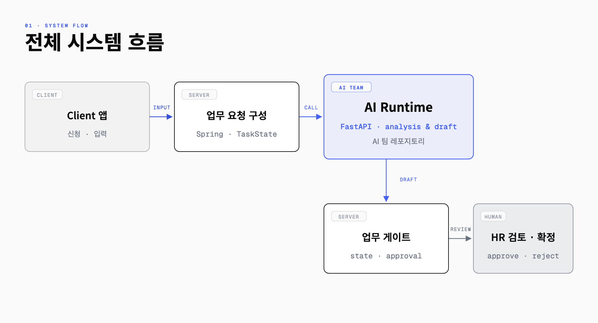
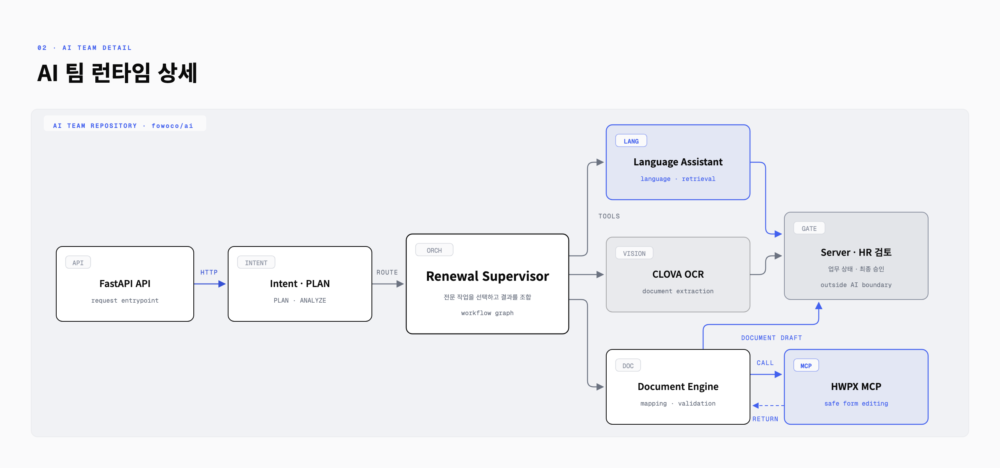

# FOWOCO AI

<p align="center">
  <a href="https://github.com/fowoco/ai/actions/workflows/ci.yml"></a>
  <a href="https://github.com/fowoco/ai/actions/workflows/deploy.yml"></a>
</p>

FOWOCO AI는 E-9 외국인근로자를 고용한 사업장의 재계약·체류기간 연장 업무를
지원하는 **FastAPI 기반 AI Runtime**입니다. HR 요청을 분석하고, 필요한 정보를
식별하며, 안내문과 행정 문서 초안을 만듭니다.

> AI의 결과는 업무 확정값이 아닙니다. 권한 확인, 공식 업무 상태, 파일 저장,
> 승인과 감사 이력은 FOWOCO Server가 관리하고 최종 판단은 HR 담당자가 수행합니다.

## 목차

- [시스템 구조](#시스템-구조)
- [AI Runtime이 하는 일](#ai-runtime이-하는-일)
- [빠른 시작](#빠른-시작)
- [API 사용](#api-사용)
- [환경 설정](#환경-설정)
- [저장소 구조](#저장소-구조)
- [개발과 검증](#개발과-검증)
- [관련 문서](#관련-문서)
- [팀 기여 원칙](#팀-기여-원칙)

## 시스템 구조

### 전체 시스템 흐름



Client는 업무 요청을 입력하고 Server는 권한과 업무 상태를 확인합니다. AI Runtime은
Server가 허용한 Context만 받아 분석 결과와 초안을 반환합니다. 이후 Server의 업무
게이트와 HR 검토를 통과해야 실제 업무에 반영됩니다.

### AI 팀 Runtime 상세



이 저장소는 **FOWOCO AI 팀이 공동으로 관리하는 Runtime**입니다. FastAPI가 요청
진입점을 제공하고, Intent·PLAN과 Renewal Supervisor가 필요한 작업을 선택합니다.
언어 지원, OCR, 문서 처리는 각각 독립된 도구 경계를 유지합니다.

문서 처리 경로는 다음 순서를 따릅니다.

```text
Document Engine → HWPX MCP → Document Engine → Server·HR 검토
```

HWPX MCP는 안전한 양식 편집 결과를 Document Engine으로 돌려줍니다. Document
Engine이 결과를 검증하고 문서 초안으로 구성한 뒤에야 Server·HR 검토 경계로
전달합니다.

## AI Runtime이 하는 일

| 영역 | 역할 | 비고 |
| --- | --- | --- |
| Intent·PLAN | HR 지시에서 Intent와 Workflow 후보를 찾고 필요한 필드를 요청 | PLAN 결정은 ANALYZE에서 재사용 |
| Renewal Supervisor | 누락 정보, 근로자 요청, OCR, 안내문, 문서 생성 경로를 선택 | 기본은 규칙 기반 Supervisor |
| Language Assistant | 표준 한국어, 쉬운 한국어, 대상 언어 안내 초안을 생성·검증 | LLM과 Qdrant는 선택 Provider |
| CLOVA OCR | 여권·외국인등록증 OCR 결과를 정규화하고 검토 사유를 반환 | 낮은 신뢰도는 HR 검토로 전환 |
| Document Engine | HWP/HWPX 검사, 템플릿 조회, 필드 편집, 문서 생성·변환 | 원본과 생성 결과를 분리 |
| HWPX MCP | HWPX 필드 탐색, 승인 기반 편집, 시각 검증을 지원 | `hwp-editor/`에 별도 서버로 구성 |

### 책임 경계

| 경계 | 책임 |
| --- | --- |
| AI | Prompt, 모델 라우팅, Intent·Agent 판단, OCR·언어·문서 도구 조합, 초안 생성 |
| Server | 인증·tenant, Worker·Task·Case, 업무 상태, 승인, FileStorage, 감사 이력 |
| Knowledge | Intent·Workflow·Slot의 canonical ID, 공식 근거, 평가 데이터 |
| Client | HR·근로자 화면, 요청 입력, 결과 검토, 승인·반려 입력 |

AI는 운영 DB를 직접 수정하지 않습니다. 필요한 필드 키를 반환하면 Server가 권한과
allow-list를 검사한 뒤 필요한 값만 다시 전달합니다. Provider 실패, 낮은 신뢰도,
필수 정보 누락은 자동 승인이나 임시 발송 대신 검토가 필요한 상태로 반환합니다.

## 빠른 시작

### 준비물

- Python 3.11 이상
- [uv](https://docs.astral.sh/uv/)

### 1. 로컬 Runtime 실행

Provider 없이 API와 기본 Runtime을 확인하는 가장 짧은 경로입니다.

```bash
uv sync --frozen --extra dev
FOWOCO_ENV_FILE=/dev/null uv run uvicorn app.main:app --reload --port 8000
```

### 2. 첫 실행 확인

```bash
curl http://localhost:8000/openapi.json
```

브라우저에서는 [http://localhost:8000/docs](http://localhost:8000/docs)의 Swagger UI를
사용할 수 있습니다.

### 3. 선택 Provider 연결

```bash
cp .env.example .env
```

`.env`의 예시 API Key와 Secret을 실제 개발용 값으로 교체한 뒤 Runtime을 다시
시작합니다. 실제 Secret은 Git에 커밋하지 않습니다.

Qdrant를 포함한 컨테이너 환경은 다음과 같이 실행합니다.

```bash
docker compose up --build
```

## API 사용

### PLAN 요청 예시

로컬에서 `FOWOCO_INTERNAL_API_TOKEN`을 설정하지 않은 경우 다음 요청으로 분석 계약을
확인할 수 있습니다.

```bash
curl --request POST http://localhost:8000/internal/v1/analyses \
  --header 'Content-Type: application/json' \
  --data '{
    "requestId": "local-plan-001",
    "phase": "PLAN",
    "analysisInput": {
      "instruction": "김민수 근로자의 체류기간 연장 준비사항을 확인해 주세요",
      "workers": []
    }
  }'
```

운영 환경에서 Internal API를 호출할 때는 Server와 공유한 Bearer Token이 필요합니다.

```http
Authorization: Bearer <FOWOCO_INTERNAL_API_TOKEN>
```

### 주요 Endpoint

| Method | Path | 역할 |
| --- | --- | --- |
| `POST` | `/internal/v1/analyses` | PLAN·ANALYZE 실행 |
| `GET` | `/internal/v1/intent/status` | Intent Provider 상태 확인 |
| `GET` | `/internal/v1/intent/readiness` | Intent warmup·readiness 확인 |
| `POST` | `/internal/v1/workflows/renewal/run` | Renewal Workflow 실행 |
| `POST` | `/internal/v1/language-assistant` | 구조화된 다국어 안내 초안 생성 |
| `POST` | `/internal/v1/ocr/worker-documents/{worker_document_id}` | 근로자 신분서류 OCR 실행 |
| `GET` | `/api/v1/documents/capabilities` | 문서 처리 기능 조회 |
| `GET` | `/api/v1/documents/templates` | 사용 가능한 문서 템플릿 조회 |
| `POST` | `/api/v1/documents/inspect` | HWP/HWPX 구조 검사 |
| `POST` | `/api/v1/documents/edit` | 문서 필드 편집 |
| `POST` | `/api/v1/documents/generate` | 템플릿 기반 문서 초안 생성 |
| `POST` | `/api/v1/documents/convert` | 지원 형식 간 변환 |

요청·응답 전체 스키마와 오류 응답은 실행 중인 Swagger UI와 [계약 문서](#관련-문서)를
기준으로 확인합니다.

## 환경 설정

기본 설정은 외부 Provider 없이도 애플리케이션이 시작되도록 구성되어 있습니다.
선택 기능을 활성화하려면 해당 환경변수와 실행 의존성을 함께 준비해야 합니다.

| 기능 | 주요 환경변수 | 미설정·비활성 상태 |
| --- | --- | --- |
| Internal API 인증 | `FOWOCO_INTERNAL_API_TOKEN` | 로컬에서는 인증 생략, OCR 활성화 시 필수 |
| Language LLM | `FOWOCO_LLM_PROVIDER`, `FOWOCO_LLM_BASE_URL`, `FOWOCO_LLM_API_KEY`, `FOWOCO_LLM_MODEL` | Language Assistant 호출 시 명시적 실패 |
| Language Retrieval | `FOWOCO_QDRANT_URL`, `FOWOCO_QDRANT_API_KEY` | Retrieval 없이 degraded 경로 사용 |
| Intent 모델 | `FOWOCO_INTENT_MODEL_ENABLED`, `FOWOCO_INTENT_BERT_MODEL_DIR`, `FOWOCO_HF_TOKEN` | 재갱신 Intent stub 사용 |
| A.X 보완 | `FOWOCO_INTENT_ENABLE_AX`, `FOWOCO_INTENT_AX_BASE_MODEL`, `FOWOCO_INTENT_AX_ADAPTER_PATH` | BERT·규칙 경로만 사용 |
| Supervisor | `FOWOCO_SUPERVISOR_MODE` | 기본값 `rules` |
| CLOVA OCR | `FOWOCO_CLOVA_OCR_ENABLED`, `FOWOCO_CLOVA_OCR_INVOKE_URL`, `FOWOCO_CLOVA_OCR_SECRET` | OCR API가 `503` 반환 |
| 문서 변환 | `FOWOCO_HWP_TO_HWPX_ENABLED`, `FOWOCO_HWPX_TO_HWP_ENABLED`, `FOWOCO_HWPX_PDF_ENABLED` | 활성화하지 않은 변환은 사용 불가 |

전체 변수, 기본값, opt-in 조건은 [.env.example](.env.example)과
[`Settings`](app/core/config.py)을 함께 확인합니다.

## 저장소 구조

```text
app/
├── main.py                 FastAPI 애플리케이션 진입점
├── api/                    HTTP Route, Schema, Internal 인증
├── agents/
│   ├── intent/             Intent 분류와 Guardrail
│   ├── language/           다국어 안내 생성·검증
│   └── workflow_graph/     Renewal Supervisor와 Workflow Graph
├── ocr/                    CLOVA OCR Adapter와 결과 정규화
├── documents/              HWP/HWPX 검사·편집·생성·변환
├── db/                     로컬·테스트용 인메모리 Adapter
└── core/                   환경 설정과 공통 기반

hwp-editor/                 HWPX Editor MCP Server
docs/                       계약·운영·평가 문서
scripts/                    모델·검색 데이터·평가 도구
tests/                      단위·계약·통합 테스트
```

`app/db`는 운영 업무 데이터의 기준 저장소가 아닙니다. 운영 Worker·Task·Case와
승인 상태는 FOWOCO Server가 소유합니다.

## 개발과 검증

### 기본 검사

```bash
uv run ruff check app tests
PYTHONPATH=. FOWOCO_ENV_FILE=/dev/null uv run pytest \
  -m "not qdrant_integration and not language_models and not rhwp_integration and not windows_ocr"
```

### 선택 통합 검사

| Marker | 필요한 환경 |
| --- | --- |
| `qdrant_integration` | Qdrant와 `language-retrieval` 의존성 |
| `language_models` | 고정된 언어 모델 Cache |
| `rhwp_integration` | `rhwp` 실행 파일과 문서 변환 환경 |
| `windows_ocr` | Windows PowerShell OCR Smoke 환경 |

기능을 변경할 때는 정상 결과뿐 아니라 Provider 비활성, Timeout, 낮은 신뢰도,
검토 필요 응답도 함께 검증합니다.

## 관련 문서

| 찾는 내용 | 문서 |
| --- | --- |
| Server 연결·인증·식별자 | [AI Runtime Handshake](docs/ai-runtime-handshake.md) |
| PLAN·ANALYZE 계약 | [Analyses Contract](docs/analyses-contract.md) |
| Renewal Workflow 계약 | [Workflows Contract](docs/workflows-contract.md) |
| Slot 재조회·재호출 | [Slot Refill Contract](docs/slot-refill-contract.md) |
| Language Assistant 운영 | [Language Assistant Operations](docs/language-assistant-operations.md) |
| Language 품질 기준 | [Language Assistant Baseline](docs/evaluations/language-assistant-baseline.md) |
| CLOVA OCR 연동 | [CLOVA OCR Integration](docs/clova-ocr-integration.md) |
| HWP/HWPX 처리 | [Document Engine](app/documents/README.md) |
| HWPX MCP 사용 | [HWPX Editor MCP](hwp-editor/README.md) |

## 팀 기여 원칙

이 저장소의 코드, 다이어그램, 문서는 FOWOCO AI 팀의 공동 자산입니다. 변경할 때는
개인별 작업 소개보다 Runtime 계약과 팀이 재현할 수 있는 검증 결과를 우선합니다.

- API Schema를 바꾸면 관련 계약 문서와 테스트를 함께 수정합니다.
- Provider 기능은 활성 조건, 실패 방식, 검토 경로를 문서화합니다.
- 자동 승인·자동 발송·운영 DB 직접 수정 경계를 확장하지 않습니다.
- Secret, 실제 개인정보, 내부 파일 경로를 커밋하지 않습니다.
- README에는 현재 코드로 재현 가능한 실행 방법만 유지합니다.
