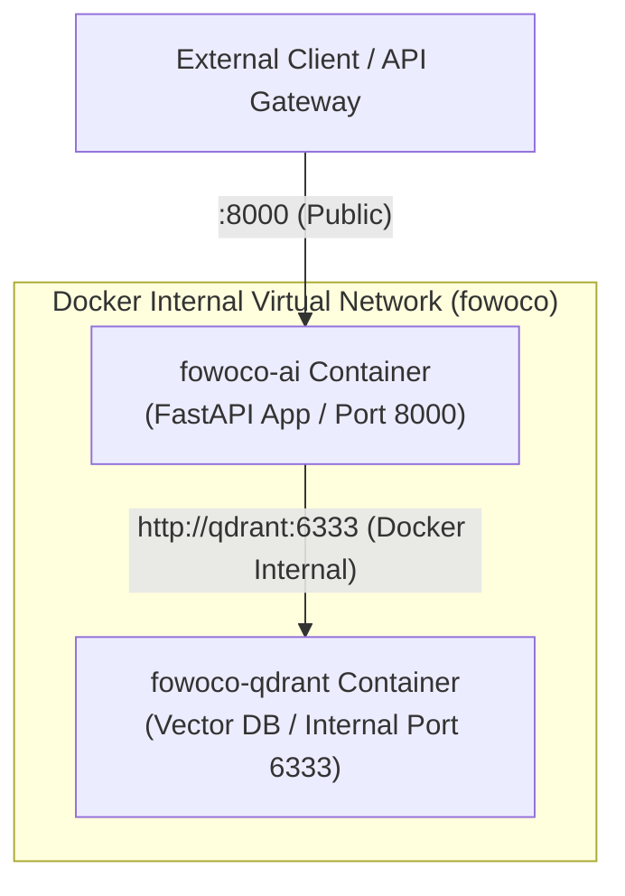

# Language Assistant — Architecture & Technical Decision Record (ADR)

Language Assistant 시스템의 **기술 심화 아키텍처, 의사결정 배경 (ADR), Vector DB 인덱싱 구조, 프라이버시 및 장애 격리 메커니즘**을 다루는 심화 가이드입니다.

---

## 1. AI/ML 모델 선정 이유 (ADR-001)

### (1) 임베딩 모델: `BAAI/bge-m3`
- **선정 배경**: 외국인 근로자 15개 다국어(베트남어, 몽골어, 테툼어, 신할라어 등)와 한국어 행정 용어 간의 정확한 검색이 핵심 요구사항이었습니다.
- **채택 사유**:
  1. **100+ 언어 지원**: 현존 임베딩 모델 중 고용허가제 15개국 언어 지원율이 가장 높음.
  2. **Dense + Sparse 하이브리드 지원**: 1024차원 수치 벡터(Dense, 의미 유사도)와 BM25 스타일 토큰 가중치 벡터(Sparse, 키워드 정확도)를 동시에 생성 가능.
  3. **RRF 정렬 우수성**: 키워드 단어 정합성과 문장 맥락 의미 정합성을 다중 질의 RRF (Reciprocal Rank Fusion, k=60) 알고리즘으로 결합할 수 있는 최적의 모델.

### (2) 리랭커 모델: `BAAI/bge-reranker-v2-m3`
- **선정 배경**: Vector DB에서 1차 검색된 상위 30개 후보 중 유효한 맥락을 십자 어텐션(Cross-Attention)으로 정밀 재정렬할 필요가 있었습니다.
- **채택 사유**: 임베딩 모델(`bge-m3`)과 동일한 토크나이저 표현 공간을 공유하여 다국어 용어 랭킹 정밀도를 보장함.

### (3) LLM 추상화 인터페이스: `OpenAI-compatible`
- **선정 배경**: 특정 LLM 벤더(OpenAI, Anthropic, Local vLLM 등)에 종속되지 않고 포팅이 가능해야 합니다.
- **구현 방식**: `app/agents/language/generation/openai_compatible.py`에 OpenAI 표준 JSON-mode 규격을 적용. `.env`에서 `FOWOCO_LLM_PROVIDER`, `FOWOCO_LLM_BASE_URL`, `FOWOCO_LLM_API_KEY`, `FOWOCO_LLM_MODEL` 환경변수만 변경하면 즉시 원하는 모델로 변경 가능.

---

## 2. Vector DB (EPS DB) 청킹 및 인덱싱 구조 (ADR-002)

### (1) 청킹 (Chunking) 방식
일반적인 긴 문서(PDF, 긴 텍스트)의 슬라이딩 윈도우 청킹 방식 대신, **행정 업무 단위 문장/표현 쌍 (Sentence-level Pair)** 기반의 맞춤 정제 방식을 적용했습니다.

- **데이터 원본**: `data/eps_language_db.json` (총 17,902개 EPS 전용 표현 레코드)
- **정제 파이프라인**:
  1. **유니코드 NFC 정규화**: 한글 자소 분리 현상 정규화 및 특수 무효 공백 제거.
  2. **결정적 ID 부여**: `UUID5(namespace, korean_text + lang)`를 사용하여 데이터 중복 및 불일치 100% 방지.
  3. **Payload 구조**:
     ```json
     {
       "korean_text": "체류기간 연장 신청서를 제출해야 합니다.",
       "translated_text": "Nộp đơn xin gia hạn thời gian lưu trú.",
       "eps_language_code": "vi",
       "source_page": "eps_guide_p12"
     }
     ```

### (2) Qdrant 인덱스 및 스키마 구조
- **컬렉션 명**: `eps_language_phrases_active`
- **Dense Vector**: `bge-m3` 1024차원 수치 벡터 (Cosine Distance)
- **Sparse Vector**: 토큰 가중치 희소 벡터
- **검색 로직**: 3개 멀티 쿼리 생성 → Qdrant 하이브리드 검색 → RRF(k=60) 병합 → BGE-Reranker 재정렬 → 상위 5개 Context 선택.

---

## 3. Context Pack (법제처 알기 쉬운 법령 정비기준 10판) (ADR-003)

### (1) 배경 및 원본 자료
법제처 『알기 쉬운 법령 정비기준 제10판 수정증보판』 기준을 알기 쉬운 한국어(Easy Korean) 재작성 및 검증에 반영했습니다.

### (2) 리소스 정제 및 버전 관리
PDF 원본 규칙을 추출하여 버전 관리 리소스 패키지로 탑재했습니다:
- **리소스 위치**: `app/agents/language/resources/easy_korean_rules.v1.json` (SHA-256 무결성 검증 포함)
- **적용 규칙**:
  1. **쉬운 우리말 교체**: 한자어/어려운 행정 용어 변환 (예: "금회" → "이번", "지체 없이" → "곧바로", "시행하다" → "실시하다")
  2. **단문 분리**: 50자 이상의 복잡한 복문을 2개 이상의 명확한 단문으로 분리
  3. **경어체 표준화**: 존댓말 어미(~하세요, ~내세요) 정규화
  4. **지시대명사 명확화**: "상기 서류" → "요청받은 서류"로 직관적 표현 변환
- **버전 확장성**: 법제처 개정판이 나올 경우 `easy_korean_rules.v2.json` 형태로 파일만 추가하여 버전 전환이 가능합니다.

---

## 4. LangGraph 병렬 처리 및 장애 격리 (ADR-004)

### (1) 병렬 처리 (Fan-Out / Fan-In)
- 표준 한국어가 작성된 후, **Easy Korean Subgraph**와 **Native Translation Subgraph**가 브랜치 간 간섭(Edge) 없이 완전 독립 병렬 실행됩니다.
- 상위 State(`LanguageAssistantState`)의 `easy_result`와 `translation_result` 독립 키로 병합(Fan-In)되어 상태 충돌이 없습니다.

### (2) 장애 격리 데코레이터 (`with_fault_isolation`)
- `app/agents/language/observability.py`에 `with_fault_isolation` 데코레이터를 탑재.
- 하위 그래프 실행 중 Qdrant 다운, LLM 타임아웃, 예외가 발생하더라도 **상위 파이프라인으로 예외가 전파되어 크래시되지 않고, 포착되어 PII-free WarningItem과 표준 한국어 Fallback 결과로 복구**됩니다.

---

## 5. 상태 플래그 및 Warning taxonomy (ADR-005)

### (1) `generation_status` 상세
- `success`: 쉬운 한국어 및 번역 완료, 사실 보존 100% 검증 통과, 경고 0건.
- `warning`: 생성되었으나 주의 조건 발생 (EPS 미매칭 Fallback 번역 사용, 1회 재시도 수행 등).
- `failed`: 번역 생성이 완전히 실패하여 `translated_text == None`인 상태.

### (2) `requires_human_review` 및 진단 필드
- `requires_human_review`: 자동 발송 시스템 확장 시 `generation_status != "success"` 건을 사람 검수 큐로 보내는 예외 판단 필드. (무조건 수동 검수 운영 시 무시 가능)
- `component_status` & `warnings`: 21개 규격화된 `WarningCode` enum 기반 백엔드 디버깅 및 모니터링 로그 기록 필드.

---

## 6. 오프라인 평가 Harness (W5)

- **위치**: `scripts/evaluate_language_retrieval.py`, `scripts/evaluate_language_generation.py`
- **시나리오**: 15개 언어 60개 평가 시나리오 (`tests/fixtures/language/`)
- **오프라인 안전성**: `--validate-only` 플래그를 제공하여 실 LLM/Qdrant 연동 없이 1.6초 만에 데이터 스키마 및 지표 로직을 자동 검증합니다.

---

## 7. Docker Compose 컨테이너 네트워크 통신 구조 (ADR-006)

### (1) 컨테이너 서비스 네트워크 통신 (`compose.yml`)
AI 에이전트 서비스와 Vector DB(Qdrant) 서비스가 **Docker Compose 내부 가상 네트워크**로 묶여 구동됩니다:



### (2) Qdrant 보안 포트 노출 정책
- **내부 전용 바인딩 (`expose`)**: Qdrant 컨테이너는 외부 호스트 포트 바인딩 없이 `expose: ["6333", "6334"]`로 설정됩니다.
- **보안 이점**: 외부 네트워크 망에 Qdrant 6333 포트가 노출되지 않으며, 오직 동일 Docker 네트워크 내의 `fowoco-ai` 컨테이너에서만 `http://qdrant:6333` 호스트명으로 안전하게 접근 가능합니다.

