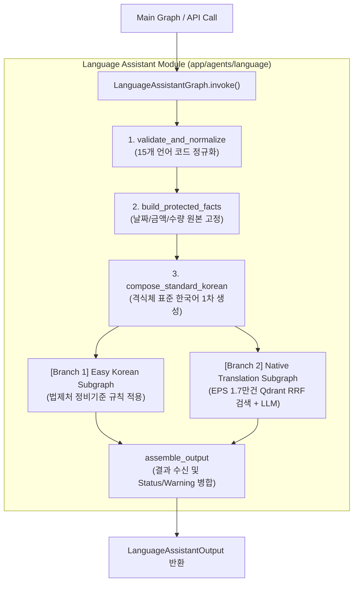

# Language Assistant — 개발자 온보딩 및 연동 가이드

외국인 근로자를 위한 **15개 다국어 행정·노동 정보 지원 파이프라인** 모듈입니다.  
이 문서는 메인 그래프 담당 팀원, 프론트엔드 개발자, 신규 엔지니어가 빠르게 연동하고 동작 원리를 이해할 수 있도록 작성되었습니다.

---

## 0) ⚡ 핵심 문서 목차

- **1) 시스템 개요 및 아키텍처**: [1) 시스템 개요 및 아키텍처](#1-시스템-개요-및-아키텍처-system-overview)
- **2) 메인 그래프 팀원 연동 가이드**: [2) Main Graph Integration Guide](#2-main-graph-integration-guide)
- **3) 입출력 데이터 명세**: [3) Input & Output Contracts](#3-input--output-contracts)
- **4) 지원 언어 목록**: [4) Supported Languages](#4-supported-languages)
- **5) 로컬 실행 및 테스트**: [5) Local Dev & Testing](#5-local-dev--testing)
- **기술 심화 및 의사결정 배경 (ADR)**: [README.dev.md](./README.dev.md) 참고

---

## 1) 시스템 개요 및 아키텍처 (System Overview)

### What / Why
- **목표**: 대한민국 고용허가제(EPS) 외국인 근로자에게 체류기한, 필요서류, 수수료, 안전수칙 등을 **15개 원어 번역 및 알기 쉬운 한국어(Easy Korean)**로 정확히 변환하여 전달합니다.
- **핵심 특징**:
  - **보안 격리 (PII Protection)**: 메인 그래프의 수많은 데이터 중 언어 지원에 필요한 4개 필드만 추출하여 전달.
  - **사실 고정 (Protected Facts)**: 날짜("2026-08-15"), 금액("150,000원"), 서류 수량 등 핵심 정보를 생성 전 고정하여 손상 차단.
  - **병렬 처리 (LangGraph Fan-Out)**: 알기 쉬운 한국어 재작성과 원어 번역 하위 그래프를 동시 실행.
  - **장애 격리 (Fault Isolation)**: LLM이나 Vector DB 장애 시 시스템다운 없이 격식체 표준 한국어로 안전하게 Fallback.

### Architecture



---

## 2) Main Graph Integration Guide

메인 그래프 담당 팀원은 아래 **2가지 단계**로 Language Assistant 모듈을 등록하고 결과를 활용할 수 있습니다.

### Step 1: 메인 State에 필드 선언
메인 그래프의 `TypedDict` State에 `LanguageAssistantOutput` (또는 `dict`)을 추가합니다.

```python
from typing import TypedDict, Any
from app.agents.language.contracts import LanguageAssistantOutput

class MainState(TypedDict):
    # ... 메인 그래프의 기존 필드들 ...
    language_assistant: LanguageAssistantOutput  # 결과가 저장될 필드
```

### Step 2: 메인 그래프 노드 등록
`build_language_assistant_node(service)` 어댑터를 사용하여 메인 그래프에 노드로 등록합니다.

```python
from app.agents.language.service import get_language_assistant_service
from app.agents.language.nodes import build_language_assistant_node
from langgraph.graph import StateGraph

# 1. 런타임 서비스 파사드 획득
service = get_language_assistant_service()

# 2. 메인 그래프용 노드 함수 생성
language_node = build_language_assistant_node(service)

# 3. 메인 그래프에 추가
builder = StateGraph(MainState)
builder.add_node("language_assistant", language_node)
# ... 엣지 연결 ...
```

---

## 3) Input & Output Contracts

### 입력 객체 (`LanguageAssistantInput`)

| 필드명 | 타입 | 설명 | 예시 |
|---|---|---|---|
| `worker_id` | `str` | 근로자 식별자 | `"worker-123"` |
| `preferred_language` | `str` | 희망 언어 코드 | `"vi"` (베트남어) |
| `nationality_code` | `str \| None` | 국적 코드 (선택) | `"VN"` |
| `request_context` | `RequestContext` | 요청 맥락 객체 | 사유, 필요서류 목록, 기한, 제출방법 |

```python
from datetime import date
from app.agents.language.contracts import LanguageAssistantInput, RequestContext

ctx = RequestContext(
    request_reason="체류기간 연장 신청 (2026-08-15까지)",
    requested_items=("여권 사본 1부", "근로계약서 사본 1부"),
    deadline=date(2026, 8, 15),
    submission_method="출입국 관서 2층 방문 제출"
)

inp = LanguageAssistantInput(
    worker_id="worker-123",
    preferred_language="vi",
    nationality_code="VN",
    request_context=ctx
)
```

### 출력 객체 (`LanguageAssistantOutput`)

| 필드명 | 타입 | 설명 | 활용 방법 |
|---|---|---|---|
| `standard_korean_text` | `str` | 격식체 표준 한국어 원문 | 백엔드 저장 / 기본 한국어 |
| `easy_korean_text` | `str` | 알기 쉬운 한국어 재작성문 | **프론트엔드 전송 (쉬운 한국어)** |
| `translated_text` | `str \| None` | 대상 언어 원어 번역문 | **프론트엔드 전송 (원어 번역)** |
| `generation_status` | `str` | `"success" \| "warning" \| "failed"` | 생성 상태 플래그 |
| `requires_human_review` | `bool` | 사람 검수 필요 여부 | 무조건 검수 시 무시 가능 |
| `warnings` | `tuple` | 경고 항목 목록 | 백엔드 디버깅 로그용 |
| `component_status` | `ComponentStatus` | 각 하위 모듈별 상태 | 디버깅용 모니터링 |

---

## 4) Supported Languages

고용허가제(EPS) 주요 15개 송출국 언어를 완벽 지원합니다:

| 언어 코드 | 언어명 | 주요 국가 | 언어 코드 | 언어명 | 주요 국가 |
|---|---|---|---|---|---|
| `en` | 영어 | 글로벌/필리핀 | `ru` | 러시아어 | 중앙아시아 |
| `zh-Hans` | 중국어 (간체) | 중국 | `uz` | 우즈베크어 | 우즈베키스탄 |
| `vi` | 베트남어 | 베트남 | `ky` | 키르기스어 | 키르기스스탄 |
| `th` | 태국어 | 태국 | `bn` | 벵골어 | 방글라데시 |
| `fil` | 필리핀어 | 필리핀 | `ur` | 우르두어 | 파키스탄 |
| `id` | 인도네시아어 | 인도네시아 | `km` | 크메르어 | 캄보디아 |
| `mn` | 몽골어 | 몽골 | `tet` | 테툼어 | 동티모르 |
| `si` | 신할라어 | 스리랑카 | | | |

---

## 5) Configuration & Environment Variables

`.env` 파일에 아래 환경변수들을 설정합니다:

```env
# Vector DB (Qdrant) 연동
FOWOCO_QDRANT_URL=http://qdrant:6333
FOWOCO_QDRANT_COLLECTION_ALIAS=eps_language_phrases_active

# LLM 연동 (OpenAI-compatible 규격)
FOWOCO_LLM_PROVIDER=openai-compatible
FOWOCO_LLM_BASE_URL=https://api.openai.com/v1
FOWOCO_LLM_API_KEY=your-openai-api-key
FOWOCO_LLM_MODEL=gpt-4o-mini
FOWOCO_LLM_TIMEOUT_SECONDS=30
```

---

## 6) Local Dev & Testing

CLI 환경에서 빠르게 테스트 스위트 및 라우터를 실행해볼 수 있습니다:

```bash
# 1. 전체 453개 유닛/통합 테스트 전수 실행
.venv/bin/python -m pytest

# 2. HTTP 엔드포인트 동작 검증
.venv/bin/python -m pytest tests/api/test_language_endpoint.py -v

# 3. OpenAPI 명세서 재생성
.venv/bin/python scripts/export_language_schemas.py
```

---

## 7) Docs Index & Deep Dive

- **기술 심화 및 의사결정 기록 (ADR)**: [README.dev.md](./README.dev.md)
- **운영 런북 & 장애 복구**: [docs/language-assistant-operations.md](../../../docs/language-assistant-operations.md)
- **평가 하네스 결과 (Baseline)**: [docs/evaluations/language-assistant-baseline.md](../../../docs/evaluations/language-assistant-baseline.md)
