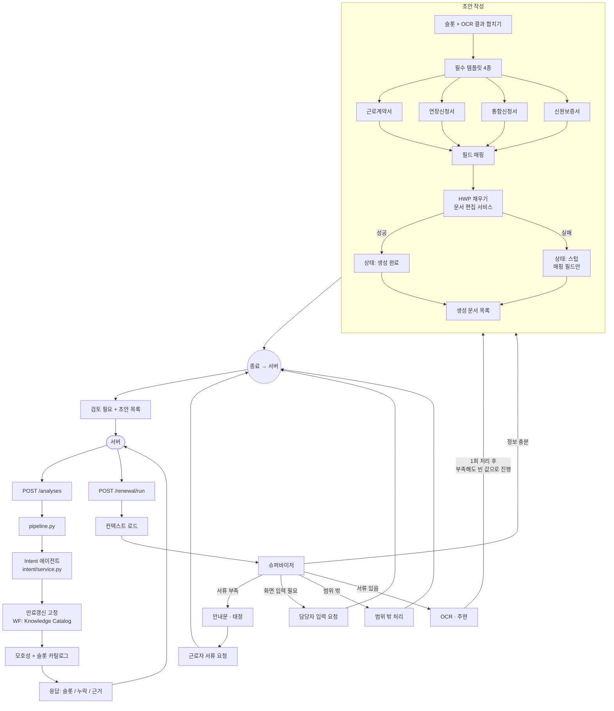

# Workflow Graph — 동료 노드·슈퍼바이저·서브그래프 통합 가이드

재갱신(Expiry Renewal) LangGraph 오케스트레이션 패키지다.  
**휘(메인 그래프·슈퍼바이저)**가 Shared State·분기·Case/Task **신호**를 소유하고,  
**안내문(태정)** / **OCR(주현)** / **초안 작성**은 교체·확장 지점이다.  
**Server**가 Case/Task를 생성하고 UI status를 반영한다.

## 패키지

```text
app/agents/workflow_graph/
├─ state.py                Shared State (+ phase/step/evidence/progress)
├─ init_state.py           요청 → Shared State 초기화
├─ phases.py               4 Phase · Step 신호
├─ supervisor.py           슈퍼바이저 (rules | llm)
├─ document_validation.py  여권×등록증 조합
├─ document_field_map.py   슬롯 → 템플릿 필드 매핑
├─ subgraphs.py            language / ocr / document 서브그래프
├─ status.py               TaskStatus
├─ protocols.py            LanguageNode / OcrNode
├─ adapters.py             Language/OCR 어댑터 (필드 정규화)
├─ language_bridge.py      LanguageAssistant → guide 노드
├─ ocr_bridge.py           documents.fields → 신분 슬롯
├─ task_store.py           Task 상태 저장
├─ nodes/
│  ├─ actions.py           시나리오 신호·load_context
│  ├─ document_generator.py 초안 4종 생성
│  ├─ language_stub.py     Intent/Slot stub (안내문≠Language Assistant)
│  └─ ocr_stub.py          OCR stub 폴백
├─ graph.py                메인 그래프 조립
└─ service.py              RenewalOrchestrator
```

`get_renewal_orchestrator()`는 `DocumentOcrNode` + (가능하면) `LanguageGuideBridge`를 연결한다.  
Language 환경변수(.env)가 없으면 503(서버 다운 방지) 후 guide는 placeholder로 폴백한다.

### renewal/run 와이어 (Server)
- `documents[].fields` — CLOVA/DB 구조화 필드 (주현 컬럼명)
- `ocrResult` (요청) — OCR API 후 Server가 DB에서 읽어 선행 주입 가능
- `languageAssistant` (응답) — Language 전체 JSON (성공 시)

## 최종 흐름



- **안내문 · 태정** / **OCR · 주현**: 동료 교체 자리 (현재 stub)
- **OCR 이후**: 부족해도 담당자 입력으로 되돌아가지 않고 빈 값으로 초안 작성 진행
- **초안 작성**: 템플릿 4종 모두 필수

## 슈퍼바이저

- 기본: `FOWOCO_SUPERVISOR_MODE=rules` — 서류 조합·missing·uploads 규칙
- 옵션: `FOWOCO_SUPERVISOR_MODE=llm` + `FOWOCO_LLM_*` — 제안 라우트, 실패/불허 시 rules 폴백
- 응답: `caseSignals`, `documentValidation`, `progressEvents`, `supervisorReason`

## Shadow Planning

- 요청의 `agentMode` 기본값은 `LEGACY`입니다.
- `SHADOW`에서는 별도 Planner가 현재 State의 다음 행동을 제안합니다.
- 계획의 실행 행동은 `TOOL`, 승인·대기·발송 통제는 `SERVER_CONTROL`로 구분합니다.
- 계획 자체는 `decisionType=AGENT_JUDGMENT`로 기록합니다.
- 실제 Graph 분기는 계속 기존 Supervisor가 결정하며 Shadow 계획은 상태·문서를 변경하지 않습니다.
- 비교 결과는 `progressEvents`의 `subgraph=agent-shadow` 이벤트로만 반환합니다.

## Shared State (추가 필드)

| 필드 | 설명 |
|---|---|
| `phase` / `step` | PHASE_1~4 / STEP_2·5·7·11·13 |
| `progress_events` | 이번 호출 진행 로그 (Server 폴링·UI) |
| `evidence` | Intent·서류 근거 |
| `document_validation` | passport/alien combo |
| `case_signals` | Server Case/Task용 신호 (생성은 Server) |

신분 슬롯(`IDENTITY_SLOTS`): `passport_number`, `alien_registration_number`, `nationality`, `full_name`, `date_of_birth`

## Language / OCR 어댑터

```python
from app.agents.workflow_graph import LanguageNodeAdapter, OcrNodeAdapter, RenewalOrchestrator

orch = RenewalOrchestrator(
    language_node=LanguageNodeAdapter(my_language_engine),
    ocr_node=OcrNodeAdapter(my_ocr_engine),
)
```

## API

```text
POST /internal/v1/workflows/renewal/run
POST /internal/v1/analyses
```

## DB

- 담당자 입력: `WorkerCompanyLookup`
- 근로자 서류: `IdentityStore.save_identity_slots`
- 1차: `app/db/memory.py`
