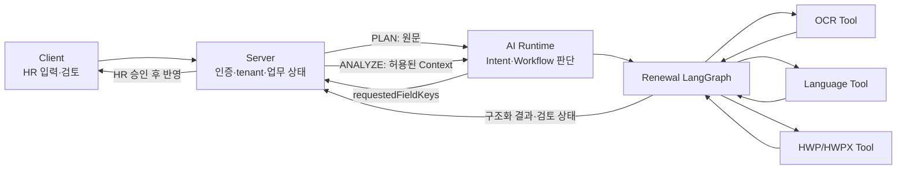
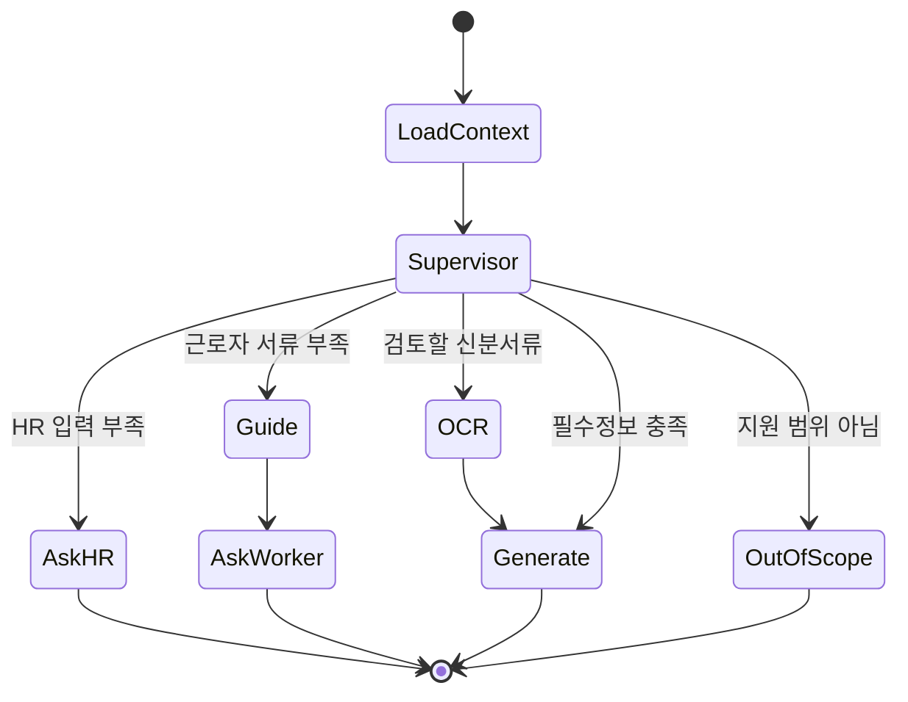

# Architecture & Code Tour

FOWOCO AI는 모델이 업무 DB를 직접 조작하는 자율 실행기가 아니라, Server가 제공한
검증된 Context 안에서 판단과 Tool 실행 결과를 반환하는 내부 Runtime입니다.

## 전체 경계

AI가 소유하는 것은 Prompt, 모델 라우팅, Agent 분기, Tool 조합입니다. 사용자 권한,
사업장 격리, Task 전이, 공식 파일, 감사로그는 Server가 소유합니다.

## 실행 파이프라인

### 1. PLAN — 업무와 필요한 Context 결정

- 진입: [`app/api/routes/analyses.py`](../app/api/routes/analyses.py)
- 조합: [`app/api/dependencies.py`](../app/api/dependencies.py)
- 실행: [`app/agents/pipeline.py`](../app/agents/pipeline.py)
- Intent: [`app/agents/intent`](../app/agents/intent)

PLAN은 `detectedIntent`, canonical `workflowId`, `requestedFieldKeys`를 반환합니다.
Worker·Company 값을 직접 조회하지 않습니다.

### 2. ANALYZE — Server Context로 질문·Candidate 생성

Server는 PLAN 결정을 저장하고 권한이 확인된 값만 보충합니다. ANALYZE는
`plannedIntent`, `plannedWorkflowId`를 재사용하므로 Intent 모델을 다시 호출하지 않습니다.

- 질문 판단: [`app/agents/ambiguity`](../app/agents/ambiguity)
- Workflow Candidate: [`app/agents/workflow`](../app/agents/workflow)
- 계약 Fixture: [`examples/analyses`](../examples/analyses)

### 3. Renewal — 명시적 상태 기반 분기

- 그래프: [`app/agents/workflow_graph/graph.py`](../app/agents/workflow_graph/graph.py)
- 상태: [`app/agents/workflow_graph/state.py`](../app/agents/workflow_graph/state.py)
- Supervisor: [`app/agents/workflow_graph/supervisor.py`](../app/agents/workflow_graph/supervisor.py)
- Node 동작: [`app/agents/workflow_graph/nodes`](../app/agents/workflow_graph/nodes)

## Tool과 Agent 판단 구분

| 구분 | 코드 | 특징 |
| --- | --- | --- |
| Intent Agent | [`app/agents/intent`](../app/agents/intent) | BERT·Guardrail·A.X 결과를 공통 계약으로 변환 |
| Renewal Agent | [`app/agents/workflow_graph`](../app/agents/workflow_graph) | Slot·서류 상태를 보고 다음 분기 제안 |
| OCR Tool | [`app/ocr`](../app/ocr) | CLOVA 응답을 허용된 문서 필드로 정규화 |
| Language Tool | [`app/agents/language`](../app/agents/language) | 표준·쉬운 한국어와 대상 언어 초안 생성·검증 |
| Document Tool | [`app/documents`](../app/documents) | 템플릿과 field map을 사용한 결정론적 생성·변환 |
| HWPX MCP | [`hwp-editor`](../hwp-editor) | HWPX 구조 분석, 승인 편집, 무결성·시각 검증 |

OCR·문서 Tool은 정해진 입력을 처리합니다. 어떤 Tool을 호출할지와 추가 정보가
필요한지는 Agent가 제안합니다. 결과를 실제 업무에 반영할지는 Server와 HR이 결정합니다.

## 실패 시 정책

| 상황 | AI 응답 | Server 동작 |
| --- | --- | --- |
| Intent 모델 비활성 | Stub 또는 readiness 비가용 상태 | 데모·운영 설정을 구분 |
| Worker Context 부족 | `CONTEXT_REQUIRED` 또는 `NEEDS_INFO` | 허용된 field만 조회하거나 HR 질문 |
| 번역 실패·검토 필요 | `guideReviewRequired=true`, `workerRequestMessage=null` | 자동 발송 금지, HR 직접 검토 |
| OCR 낮은 신뢰도 | 필드별 confidence와 검토 사유 | HR 승인 전 Worker 정보 미반영 |
| 문서 Provider 실패 | 생성 실패 상태와 오류 코드 | 파일·Task 자동 완료 금지 |

## 검증 코드

| 검증 관점 | 위치 |
| --- | --- |
| API·인증 계약 | [`tests/api`](../tests/api) |
| PLAN·ANALYZE Fixture | [`tests/contracts`](../tests/contracts) |
| Intent·Workflow Agent | [`tests/agents`](../tests/agents) |
| OCR 정규화·Provider 격리 | [`tests/ocr`](../tests/ocr) |
| HWP·HWPX 생성·변환 | [`tests/documents`](../tests/documents) |
| Qdrant·모델 선택 통합 | [`tests/integration`](../tests/integration) |

기본 CI는 외부 Secret 없이 결정론적 테스트를 실행하고, Qdrant와 Windows OCR 계약을
별도 Job으로 분리합니다. 실제 Provider 품질은 환경별 Smoke Test로 별도 확인합니다.
