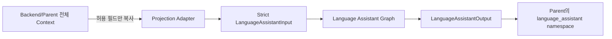
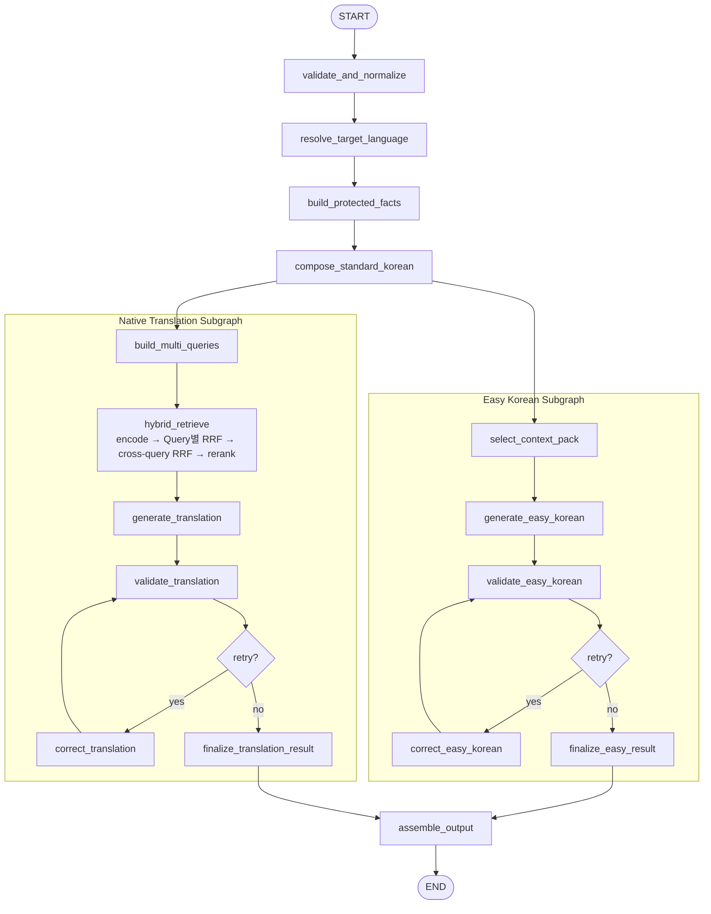

# Language Assistant Graph 상세 설계

## 1. 문서 상태

- 작성일: 2026-08-02
- 상태: 구현 전 검토안
- 대상 저장소: `fowoco/ai`
- 기준 브랜치 확인 시점: `develop` / `3d3fa19`
- 관련 Notion: [Language Assistant Graph](https://app.notion.com/p/Language-Assistant-Graph-3af0296c12aa80579f00e39b3396132f)
- 구현 계획: `docs/engineering/plans/2026-08-02-language-assistant-graph.md`

### Supersedes

이 문서는 아래 과거 설계 중 충돌하는 구현 결정을 대체한다.

- 자유 발화문 또는 `source_text`를 입력으로 받는 설계
- 전체 Worker/Company/Document 객체를 Language Assistant State나 Prompt에 넣는 설계
- 단일 Query Rewriting 설계
- 한국어식 발음, 로마자 표기, `pronunciation` 생성 설계
- Supervisor Graph가 있어야만 실행 가능한 설계
- Language Assistant가 발송 또는 발송 차단을 결정하는 설계
- 2026-07-29 커밋 `6611d9b`의 발음 포함 Advanced RAG 설계

Notion의 제품 의도와 사용자 흐름은 유지한다. 입력 권한, 검색 방식, 출력 계약은 이 문서의 최신 결정을 따른다.

## 2. 목표와 책임

기업 담당자가 확정한 구조화 요청으로 다음 세 결과를 만든다.

1. 일반 한국어
2. 쉬운 한국어
3. 근로자의 선호 언어 번역문

Language Assistant는 메시지를 만들고 품질 상태를 반환한다. 메시지 수정, 사용자 승인, 실제 발송, 발송 이력은 프론트엔드와 백엔드 책임이다.

현재 Supervisor Graph는 없다. 따라서 다음 두 호출을 모두 지원한다.

```python
result = language_assistant_graph.invoke(initial_state)
```

여기서 `language_assistant_graph`는 public facade다. `initial_state`는 5장의 네 top-level 필드를 가진 mapping 또는 `LanguageAssistantInput`이며, facade가 이를 검증해 private compiled LangGraph의 `{"input": request}` State로 감싼다. 호출자가 내부 State envelope를 알아야 하는 구조로 노출하지 않는다.

```text
Parent Graph State
→ projection adapter
→ Language Assistant Graph
→ {"language_assistant": output} partial update
```

## 3. 절대 불변 조건

1. `request_context`만 메시지 내용의 사실 기준이다.
2. `standard_korean_text`는 파생 결과다. 검증 기준이 아니다.
3. `worker_id`는 응답 상관관계에만 사용한다.
4. `preferred_language`, `nationality_code`는 대상 언어 결정에만 사용한다.
5. `worker`, `worker_documents`, `company` 등 DB 객체는 생성·검색·검증·Prompt에 사용하지 않는다.
6. DB 값과 `request_context`가 충돌해도 Language Assistant는 `request_context`를 사용한다.
7. 상위 State의 DB 객체를 수정하거나 삭제하지 않는다.
8. 쉬운 한국어와 번역 Branch는 일반 한국어 생성 후 병렬 실행한다.
9. 검색 Query는 생성용 사실 근거가 아니다.
10. EPS 데이터는 검색 근거와 표현 참고다. 정답 번역 데이터셋이나 번역 모델이 아니다.
11. 발음, 로마자 표기, 메시지 발송 기능은 구현하지 않는다.

## 4. 신뢰 경계와 데이터 흐름



Projection 허용 목록:

```text
worker_id
preferred_language
nationality_code
request_context
```

상위 Context에 다음 값이 있어도 Child State로 들어가지 않는다.

```text
source_text
message_context
worker
worker_documents
company
stay_expiry_date
document metadata
```

## 5. 입력 계약

### 5.1 Strict Graph Input

```json
{
  "worker_id": "93000000-0000-0000-0000-000000000001",
  "preferred_language": "vi",
  "nationality_code": "VN",
  "request_context": {
    "request_reason": "체류기간 연장 신청",
    "requested_items": [
      "여권 사본",
      "외국인등록증 앞·뒷면"
    ],
    "deadline": "2026-08-10",
    "submission_method": "이메일에 파일을 첨부해서 보내 주세요."
  }
}
```

### 5.2 타입과 검증 규칙

```python
class RequestContext(BaseModel):
    model_config = ConfigDict(extra="forbid")

    request_reason: str
    requested_items: tuple[str, ...]
    deadline: date
    submission_method: str


class LanguageAssistantInput(BaseModel):
    model_config = ConfigDict(extra="forbid")

    worker_id: str | int
    preferred_language: str | None = None
    nationality_code: str | None = None
    request_context: RequestContext
```

세부 규칙:

- `worker_id`: opaque scalar. string이면 trim/NFC 후 1–128자, integer이면 `0..2^63-1`; bool/float는 거부하고 입력 타입과 값을 그대로 응답에 보존
- `preferred_language`: 값이 있으면 trim 후 최대 32자
- `nationality_code`: 값이 있으면 trim 후 최대 8자
- `request_reason`: trim/NFC 후 1–500자
- `requested_items`: 1–20개, 각 항목 trim/NFC 후 1–200자
- 중복 항목: 입력 오류로 숨기지 않고 순서를 유지하되 `DUPLICATE_REQUESTED_ITEM` 경고
- `deadline`: ISO `YYYY-MM-DD`; Pydantic `date`로 파싱
- `submission_method`: trim/NFC 후 1–1,000자
- Unicode: NFC 정규화
- 직접 Graph 입력의 미정의 필드: 거부
- `source_text`: 미정의 필드이므로 직접 Graph 입력에서 거부
- 입력 필드 사이의 업무적 충돌: 판단하지 않고 그대로 보존; 상위 Graph 책임

### 5.3 Transport Envelope

백엔드가 전체 Agent Context를 보내는 HTTP 경계에서는 미선언 추가 필드를 opaque Parent Context로 수신할 수 있다. 단, 라우트는 즉시 strict input으로 projection하고 원본 envelope를 Graph, Prompt, checkpoint, trace에 전달하지 않는다.

`source_text`는 Transport Envelope의 선언 필드도 Strict Graph Input의 필드도 아니다. 공유 envelope의 미선언 추가값으로 들어오더라도 다른 Parent Context와 똑같이 무시하며, 생성 입력으로 승격하지 않는다. 반면 Strict Graph Input에 직접 넣으면 `extra="forbid"`로 거부한다. 이 구분은 “전체 Context 전달 가능”과 “Language Assistant 입력 계약에서 `source_text` 제거”를 동시에 만족한다.

## 6. 출력 계약

```json
{
  "worker_id": "93000000-0000-0000-0000-000000000001",
  "target_language": "vi",
  "generation_status": "warning",
  "requires_human_review": true,
  "standard_korean_text": "...",
  "easy_korean_text": "...",
  "translated_text": "...",
  "component_status": {
    "standard_korean": "success",
    "easy_korean": "success",
    "translation": "warning"
  },
  "validation": {
    "standard_korean": {
      "status": "passed",
      "failed_checks": [],
      "inconclusive_checks": [],
      "retry_count": 0
    },
    "easy_korean": {
      "status": "passed",
      "failed_checks": [],
      "inconclusive_checks": [],
      "retry_count": 0
    },
    "translation": {
      "status": "inconclusive",
      "failed_checks": [],
      "inconclusive_checks": ["requested_items.semantic_equivalence"],
      "retry_count": 2
    }
  },
  "warnings": [
    {
      "component": "translation_validation",
      "code": "VALIDATION_RETRY_EXCEEDED",
      "message": "일부 정보 보존 검증이 완료되지 않았습니다."
    }
  ],
  "retrieval_metadata": {
    "dataset_version": "sha256:29106c33d43ccdd8453623ac1a0af44e0201d7c7cc1cc68c3fb438e0ccc61c6d",
    "query_strategies": [
      "canonical",
      "reason_items",
      "action_deadline"
    ],
    "reference_ids": [],
    "reference_count": 0,
    "fallback_used": true,
    "degraded_components": ["retrieval"]
  }
}
```

규칙:

- `generation_status`: `success | warning | failed`
- `component_status`: Branch별 `success | warning | failed`
- validation `status`: `passed | failed | inconclusive | not_run`; 후보가 없어 검증하지 못한 상태를 실패·불확정과 구분한다.
- `requires_human_review`: 품질 신호다. 발송 허용·차단 결정이 아니다.
- 생성 후보가 있고 재시도만 초과했다면 마지막 후보를 반환한다.
- 번역 생성 호출이 모두 실패해 후보가 없을 때만 `translated_text`를 `null`로 반환한다.
- `translated_text`가 없으면 전체 상태는 `failed`다.
- 쉬운 한국어 생성 후보가 없으면 정확한 `standard_korean_text`를 fallback으로 사용한다. 따라서 정상적으로 반환된 Graph 출력의 `easy_korean_text`는 `null`이 아니며 전체 상태는 최소 `warning`이다.
- `passed` validation에는 실패·불확정 check가 없고, `failed`는 failed check가 1개 이상이며, `inconclusive`는 inconclusive check가 1개 이상이다. `not_run`은 두 check 목록이 비어 있고 retry가 0이다.
- 경고 메시지에 worker ID, 원문, Prompt, 모델 raw response를 넣지 않는다.

`retrieval_metadata.fallback_used`는 “EPS Context 없이 일반 LLM 번역을 생성했음”만 뜻한다. no-match, Qdrant/encoder/schema/dataset 장애, 유효 Context 부족이면 `true`다. Reranker만 실패해 cross-query RRF Context를 사용했다면 `false`이며 `degraded_components=["reranker"]`로 표시한다. `reference_ids`에는 실제 번역 Prompt에 전달된 Context ID만 넣는다.

### 6.1 공개 응답에서 제외

```text
raw Query 문자열
EPS 문서 본문 전체
embedding/sparse vector
dense/sparse/RRF/reranker score 배열
Prompt
모델 raw response
전체 DB Context
send_allowed
delivery_recommendation
pronunciation
korean_pronunciation
romanization
```

내부 trace에는 run ID, node, 지연시간, 재시도 수, 모델/Prompt/Context Pack/데이터셋 버전, reference ID만 기록한다.

## 7. 대상 언어 정책

### 7.1 우선순위

1. `preferred_language`가 있으면 이를 정규화한다.
2. `preferred_language`가 없을 때만 `nationality_code`로 추론한다.
3. 둘 다 없거나 국적 매핑이 없으면 `en`을 사용하고 `LANGUAGE_DEFAULTED_TO_EN` 경고를 반환한다.
4. 명시된 `preferred_language`가 지원되지 않으면 국적으로 조용히 덮지 않고 입력 오류를 반환한다.
5. 유효한 선호 언어와 국적이 달라도 선호 언어를 사용하며 경고하지 않는다.

### 7.2 15개 canonical language와 EPS 코드

| 표시 언어 | Canonical | EPS | 국적 fallback |
|---|---|---:|---|
| 영어 | `en` | `01` | 없음; 최종 default |
| 중국어 간체 | `zh-Hans` | `02` | `CN` |
| 베트남어 | `vi` | `03` | `VN` |
| 태국어 | `th` | `04` | `TH` |
| 필리핀어/따갈로그어 | `fil` | `05` | `PH` |
| 인도네시아어 | `id` | `06` | `ID` |
| 몽골어 | `mn` | `07` | `MN` |
| 싱할라어 | `si` | `08` | `LK` |
| 러시아어 | `ru` | `09` | `RU` |
| 우즈베크어 | `uz` | `10` | `UZ` |
| 키르기스어 | `ky` | `11` | `KG` |
| 방글라어 | `bn` | `13` | `BD` |
| 우르두어 | `ur` | `14` | `PK` |
| 크메르어 | `km` | `15` | `KH` |
| 테툼어 | `tet` | `17` | `TL` |

국가 코드와 언어 코드는 별도 함수와 별도 table로 처리한다. 일반적인 `lower()` 변환으로 국가 코드를 언어 코드처럼 사용하지 않는다.

### 7.3 Legacy product aliases

```text
vn → vi
cn → zh-Hans
ph → fil
pk → ur
lk → si
kg → ky
bd → bn
kh → km
tl → tet
```

이 map은 제품의 과거 DB 값 호환용이다. BCP 47의 `tl`은 Tagalog지만, 이 제품의 legacy namespace에서 `tl`은 Timor-Leste 계열 값으로 취급한다. 새 값은 Filipino에 `fil`, Tetum에 `tet`만 사용한다. legacy 정규화가 일어나면 `LANGUAGE_CODE_NORMALIZED` 경고를 반환한다.

## 8. 일반 한국어 정책

초기 구현은 LLM이 아니라 결정적 formatter를 사용한다.

이 선택은 과거 “LLM 생성” 결정을 수정하는 구현 기본안이다. 구조가 네 필드로 고정됐으므로 템플릿 폭증 문제가 사라졌고, 세 출력에 공통으로 전파될 환각을 제거할 수 있다.

기본 형태:

```text
다음 요청 내용을 확인해 주세요.

요청 목적: 체류기간 연장 신청
준비할 자료:
1. 여권 사본
2. 외국인등록증 앞·뒷면
제출 기한: 2026-08-10
제출 방법: 이메일에 파일을 첨부해서 보내 주세요.
```

규칙:

- 항목 순서를 유지한다.
- `deadline`은 ISO 문자열을 그대로 노출한다.
- `submission_method`를 다시 변형하거나 “보내 주세요”를 중복 추가하지 않는다.
- worker 이름, 회사명, DB 만료일, DB 서류를 추가하지 않는다.
- 향후 LLM polish를 추가하더라도 formatter 원본은 보존하고 검증 실패 시 즉시 원본으로 복귀한다.

## 9. Protected Facts

`ProtectedFacts`는 원문에서 추출하지 않는다. 구조 필드를 복사해 만든다.

```python
class ProtectedFacts(BaseModel):
    request_reason: str
    requested_items: tuple[str, ...]
    deadline: date
    submission_method: str
    machine_tokens: tuple[ProtectedToken, ...]
```

`machine_tokens`는 네 필드 내부에서 다음을 추출한다.

- 날짜, 시간
- 숫자, 금액, 통화, 단위
- URL, 이메일, 전화번호
- 문서 식별자와 버전

구조상 별도 타입 표지가 없는 사람 이름, 회사명, 장소, 법률·제도명은 regex가 임의 추정하지 않는다. 일반 한국어와 Query에서는 전체 필드를 verbatim 보존하고, 쉬운 한국어·번역에서는 field-wise semantic 검증으로 누락·변경을 확인한다. 판별이 확정되지 않으면 성공으로 처리하지 않고 `inconclusive`와 사람 검토 신호를 반환한다.

검증은 항상 `ProtectedFacts`와 결과를 비교한다. `standard_korean_text`와만 비교하지 않는다.

## 10. Graph 구조



Easy와 Translation Branch는 서로를 입력으로 사용하지 않는다. 두 Branch는 별도 State key에만 쓰고 `assemble_output`만 최종 응답을 만든다.

Parent Graph에는 compiled Branch를 직접 넣지 않는다. `easy_korean` wrapper는 공통 사실을 `EasyBranchInput`으로 projection한 뒤 오직 `{"easy_result": ...}`만 반환하고, `native_translation` wrapper는 `TranslationBranchInput`으로 projection한 뒤 오직 `{"translation_result": ...}`만 반환한다. 두 병렬 노드가 `input`, `target_language`, `protected_facts`, `standard_korean_text`를 다시 쓰지 않으므로 shared-key reducer가 필요하지 않다.

`hybrid_retrieve`는 LangGraph 노드 하나다. encoder, Qdrant Query별 RRF, client-side cross-query RRF, reranker는 이 노드가 호출하는 `EpsRetriever` 내부 단계이며 별도 Graph State를 노출하지 않는다.

Subgraph는 자체 checkpointer 없이 compile한다. 현재 단독 실행은 stateless다. 미래 Parent Graph가 persistence를 소유한다.

## 11. Multi-Query 정책

기본 Query 수는 정확히 3개다.

```python
SearchQuery(kind="canonical", text=...)
SearchQuery(kind="reason_items", text=...)
SearchQuery(kind="action_deadline", text=...)
```

관점:

1. `canonical`: 일반 한국어 전체
2. `reason_items`: 요청 목적과 준비물 중심 배열
3. `action_deadline`: 제출 행동과 기한 중심 배열

세 Query 모두 네 `request_context` 필드와 그 안의 보호값을 유지한다. 날짜, 숫자, 금액, 이름, 회사명, 서류명, 장소, 법률·제도명을 다른 값으로 바꾸거나 placeholder로 일반화하지 않는다. Query 차이는 값이 아니라 배열과 검색 관점뿐이다.

Query는 결정적으로 생성한다. LLM Multi-Query가 필요해질 때도 동일 보존 검사를 먼저 통과해야 한다.

## 12. EPS 색인

현재 JSON snapshot:

```text
파일: data/eps_language_db.json
SHA-256: 29106c33d43ccdd8453623ac1a0af44e0201d7c7cc1cc68c3fb438e0ccc61c6d
원본 행: 17,925
빈 한국어: 0
빈 번역: 10
정확 중복: 13
색인 대상: 17,902
언어 수: 15
```

원본 JSON은 변경하지 않는다. 기존 `pronunciation` 필드는 legacy 원본에 남아 있어도 된다. 신규 색인 payload, State, Prompt, 출력에서는 읽거나 저장하지 않는다.

Point 단위는 `(EPS 언어 코드, 한국어 문장, 외국어 번역문)`이다.

```json
{
  "source_record_id": "uuid5:...",
  "korean_text": "...",
  "translated_text": "...",
  "target_language": "vi",
  "eps_language_code": "03",
  "source_page": 12,
  "dataset_revision": "sha256:...",
  "embedding_model_repo": "BAAI/bge-m3",
  "embedding_model_revision": "5617a9f61b028005a4858fdac845db406aefb181",
  "index_contract_version": "eps-language-index-v1",
  "content_hash": "sha256:...",
  "quality_status": "raw",
  "source": "EPS",
  "source_url": "https://eps.hrdkorea.or.kr/e9/user/language/language.do"
}
```

Collection:

```text
versioned collection: eps_language_phrases_<dataset-first12>_<encoder-revision-first12>
runtime alias:        eps_language_phrases_active
named dense vector:  korean_dense, cosine, 1024 dimensions
named sparse vector: korean_sparse
```

Payload index:

```text
target_language: keyword
dataset_revision: keyword
quality_status: keyword
embedding_model_repo: keyword
embedding_model_revision: keyword
index_contract_version: keyword
```

예: 현재 snapshot과 BGE-M3 revision이면 collection 이름은 `eps_language_phrases_29106c33d43c_5617a9f61b02`다. 정확 중복은 `(EPS 코드, NFC 한국어, NFC 번역문)` 기준으로 합치고, 중복 행의 `source_page`는 가장 작은 페이지를 보존한다.

새 collection 전체 색인 → count/schema/filter smoke test까지가 기본 동작이다. 현재 alias를 기록·snapshot한 뒤 명시적 `--switch-alias` 승인을 받은 경우에만 alias를 원자 교체한다. 재색인은 같은 입력으로 같은 Point ID를 만든다.

Runtime search 전에 alias가 가리키는 실제 collection을 확인한다. named vector schema, dense dimension/distance, payload index type, nonzero point count를 검사하고, dataset revision·encoder repo/full revision·index-contract version의 exact-filter count가 collection 전체 count와 같은지 확인한다. 검증 결과는 physical collection 이름을 포함한 immutable handle이다. 실제 Query는 mutable alias가 아니라 이 handle의 physical collection을 사용하므로 검증과 검색 사이 alias 교체에도 대상이 바뀌지 않는다.

이 검증을 통과한 뒤의 언어별 빈 결과만 `RETRIEVAL_NO_MATCH`다. dataset revision 불일치는 `RETRIEVAL_DATASET_MISMATCH`, encoder/index-contract 불일치는 `RETRIEVAL_INDEX_PROVENANCE_MISMATCH`, vector/payload schema 불일치는 `RETRIEVAL_SCHEMA_MISMATCH`로 분리해 단순 no-match로 숨기지 않는다.

## 13. Retrieval stack

검토 기본값:

```text
LangGraph: 1.2.10
Qdrant Server: 1.18.3
qdrant-client: 1.18.0
FlagEmbedding: 1.4.0
Dense + Sparse: BAAI/bge-m3
Reranker: BAAI/bge-reranker-v2-m3
```

고정 model revisions:

```text
BAAI/bge-m3:
5617a9f61b028005a4858fdac845db406aefb181

BAAI/bge-reranker-v2-m3:
953dc6f6f85a1b2dbfca4c34a2796e7dde08d41e
```

`main`에서 런타임 다운로드하지 않는다. 사전 다운로드한 immutable local path를 사용한다.

BGE-M3 설정:

```text
dense dimension: 1024
query max tokens: 128
return_dense: true
return_sparse: true
return_colbert_vecs: false
```

BGE-M3가 만든 lexical weight에 Qdrant BM25용 `Modifier.IDF`를 다시 적용하지 않는다.

검색 시작값:

```text
multi_query_count: 3
각 Query dense prefetch: 40
각 Query sparse prefetch: 40
각 Query Qdrant RRF limit: 30
RRF k: 60
Query 간 RRF weights: 1.0, 1.0, 1.0
Cross-query 후보: 30
Rerank 후보: 30
최종 Context: 5
```

흐름:

```text
alias target·dataset/encoder/index-contract·collection schema 검증 및 physical handle 고정
→ Query 3개 일괄 Dense+Sparse encode
→ Query별 Qdrant Dense/Sparse prefetch
→ Query별 Qdrant RRF
→ Point ID dedupe
→ Client-side cross-query RRF
→ 상위 30개 rerank
→ 상위 5개 EPS Context
```

Cross-query 동점 정렬:

```text
fusion_score DESC
→ best_rank ASC
→ point_id ASC
```

Reranker score는 관련도 점수다. 번역 품질이나 정답 확률로 해석하지 않는다. 평가 전에는 임의 score threshold를 두지 않는다. 유효 후보와 필수 payload가 있으면 참고 Context로 제공하되, 생성 모델에는 “참고 자료이며 복사 의무가 없다”고 명시한다.

## 14. 쉬운 한국어

구조:

```text
versioned Context Pack
+ controlled rewrite
+ deterministic hard validation
+ semantic validation
+ bounded correction
```

Context Pack은 다음 세 묶음이다.

```text
rewrite_rules
domain_terms
few_shot_examples
```

초기 pack은 JSON과 SHA-256 sidecar로 version/integrity 관리한다. production loader는 승인 metadata와 checksum이 모두 유효할 때만 사용한다. 법제처 자료를 런타임에 조회하지 않는다. 원문 PDF 전체를 Prompt에 넣지 않는다.

기준 출처는 법제처가 2026-01-22 게시한 [알기 쉬운 법령 정비기준 제10판 수정증보판](https://www.moleg.go.kr/board.es?act=view&bid=0001&list_no=146407&mid=a10108030000)이다. Context Pack에는 이 출처의 제목·게시일·URL과 내부 검토일을 기록하되, 서비스에 필요한 규칙과 짧은 자체 예시만 담당자 검토 후 수록한다.

규칙:

- 긴 문장 분리
- 주어와 행동 주체 명시
- 어려운 한자어와 행정용어 단순화
- 한 문장에 하나의 정보 또는 행동
- 날짜·시간·장소·준비물 명확화
- 의무·금지·경고 강도 유지
- 요청 항목과 중요 정보 삭제·추가 금지
- 전문용어는 필요한 경우 원어와 쉬운 설명 병기

LLM은 field-wise 구조화 결과를 반환한다. renderer가 필드 순서와 ISO 기한을 고정해 최종 `easy_korean_text`를 만든다.

## 15. 모국어 번역

생성 Prompt 입력은 다음뿐이다.

```text
request_context
standard_korean_text
canonical target language
선정된 EPS 한국어-외국어 Context 최대 5개
```

상위 DB 객체는 포함하지 않는다. EPS Context와 request field는 instruction이 아닌 quoted data로 전달한다.

LLM은 field-wise 구조화 결과를 반환한다.

```text
translated_reason
translated_items[]
translated_submission_method
```

renderer가 item 순서와 canonical deadline을 고정해 `translated_text`를 만든다. EPS 문장을 무조건 복사하지 않는다.

Prompt는 EPS Context가 요청 의미·용어와 맞을 때 현장 용어와 표현을 우선 참고하도록 지시한다. 다만 Context의 날짜·숫자·서류·행동이 `request_context`와 다르면 그 부분은 사용하지 않으며, `request_context`를 덮어쓸 수 없다.

검색 Context가 없거나 Qdrant가 실패해도 일반 LLM 번역을 수행한다. 이때 `fallback_used=true`와 원인별 warning을 반환한다.

## 16. 검증과 재시도

계층:

1. Pydantic 입력 검증
2. Protected Facts 구성
3. field cardinality와 구조 검증
4. 날짜·시간·숫자·금액·URL 등 deterministic 검증
5. 요청 목적·항목·행동·의무 강도 semantic 검증
6. 실패한 Branch만 수정
7. initial 1회 + correction 최대 2회
8. 마지막 후보와 품질 상태 반환

날짜는 표면 문자열이 아니라 파싱한 canonical 값으로 비교한다. `2026-08-10`과 `2026년 8월 10일`은 같은 날짜로 판단할 수 있지만, 최종 renderer는 ISO 날짜를 반드시 포함한다.

Semantic validator가 unavailable하거나 확정할 수 없으면 `inconclusive`다. 성공으로 위장하지 않고 `warning`과 `requires_human_review=true`를 반환한다.

## 17. 장애별 Fallback

| 장애 | 처리 | 경고 |
|---|---|---|
| Qdrant timeout/unavailable | EPS Context 없이 번역 | `RETRIEVAL_UNAVAILABLE` |
| Encoder unavailable | EPS Context 없이 번역 | `RETRIEVAL_ENCODER_UNAVAILABLE` |
| 보호값을 모두 담은 Query가 encoder token 한도 초과 | Query를 자르지 않고 EPS Context 없이 번역 | `RETRIEVAL_QUERY_TOO_LONG` |
| 설정 dataset revision과 alias payload가 다름 | EPS Context 없이 번역 | `RETRIEVAL_DATASET_MISMATCH` |
| encoder repo/full revision 또는 index-contract version이 다름 | EPS Context 없이 번역 | `RETRIEVAL_INDEX_PROVENANCE_MISMATCH` |
| collection/vector/payload schema가 계약과 다름 | EPS Context 없이 번역 | `RETRIEVAL_SCHEMA_MISMATCH` |
| target language 검색 결과 0건 | EPS Context 없이 번역 | `RETRIEVAL_NO_MATCH` |
| 후보는 있으나 payload/품질 조건을 통과한 Context 없음 | EPS Context 없이 번역 | `EPS_CONTEXT_INSUFFICIENT` |
| Reranker unavailable | cross-query RRF 순위 사용 | `RERANKER_UNAVAILABLE` |
| 어떤 원인이든 EPS Context 없이 번역 생성 | 원인 경고에 fallback 경고 추가 | `TRANSLATION_FALLBACK_USED` |
| Semantic validator unavailable/불확정 | 후보를 유지하고 사람 검토 요구 | `SEMANTIC_VALIDATION_INCONCLUSIVE` |
| Branch 시간 예산 초과 | 추가 호출을 중단하고 마지막 후보 또는 Branch fallback 반환 | `GENERATION_TIME_BUDGET_EXCEEDED` |
| Easy Context Pack이 미승인/손상 | Easy LLM 호출 없이 일반 한국어 사용 | `EASY_KOREAN_CONTEXT_PACK_UNAVAILABLE`, `STANDARD_KOREAN_FALLBACK` |
| 쉬운 한국어 생성 실패 | 일반 한국어 사용 | `EASY_KOREAN_GENERATION_FAILED`, `STANDARD_KOREAN_FALLBACK` |
| 번역 검증 재시도 초과 | 마지막 번역 후보 반환 | `VALIDATION_RETRY_EXCEEDED` |
| 번역 생성 후보 없음 | `translated_text=null` | `TRANSLATION_GENERATION_FAILED` |

외부 장애는 Branch 안에서 typed degradation result로 변환한다. 예상 가능한 외부 장애가 LangGraph 병렬 superstep 전체를 취소하게 두지 않는다. 프로그래밍 오류와 계약 위반만 예외로 올린다.

## 18. 관측성과 개인정보

- raw `worker_id`를 telemetry attribute로 기록하지 않는다.
- 내부 run ID로 로그를 연결한다.
- Prompt, raw response, raw Query, 전체 Context는 기본 로그 금지다.
- reference ID, dataset/model/prompt/context-pack version은 기록한다.
- LangGraph checkpointer는 기본 비활성이다.
- persistence 도입 전 암호화, retention, 삭제 정책을 별도 승인한다.
- 두 동시 요청 사이 singleton model은 공유할 수 있지만 State는 공유하지 않는다.
- 모델 inference concurrency 기본값은 1이다.

## 19. HTTP 및 상위 Graph 연결

현재 로컬 저장소에는 확정된 백엔드 `request_context` fixture가 없다. `origin/feat/analyses-contract-align`의 `AnalysisRequest`는 다른 용도이며 재사용하지 않는다.

검토 기본 endpoint:

```text
POST /internal/v1/language-assistant
```

기존 `/internal/v1/analyses` precedent와 같은 internal router를 사용한다. 실제 백엔드 fixture를 받으면 field alias만 transport schema에서 맞춘다. Domain 계약과 Graph는 바꾸지 않는다.

지원하지 않는 명시적 `preferred_language`는 data-free domain input error로 유지하고 HTTP 경계에서 422로 변환한다. 오류 응답에 거부된 값을 되돌려주지 않으며, 이 경우 nationality/English fallback이나 생성 호출을 수행하지 않는다.

이 경로는 인터넷 공개 API가 아니다. 현재 저장소에는 서비스 간 인증 middleware가 없으므로, production merge 전에 배포 계층의 private-network/gateway 인증 책임을 확인한다. 별도 인증이 필요하면 공통 API 보안 계층에서 구현하며 Language Graph나 Prompt에 인증 로직을 넣지 않는다.

Parent wrapper:

```python
def language_assistant_node(parent_state: Mapping[str, object]) -> dict[str, object]:
    child_input = project_language_input(parent_state)
    child_output = language_assistant_service.invoke(child_input)
    return {"language_assistant": child_output.model_dump(mode="json")}
```

Parent와 Child State schema가 다르므로 wrapper node에서 projection한다. Parent State 객체는 in-place 수정하지 않는다.

## 20. 구현 제외 범위

- 자유 문장 분석, Intent/Slot 추출
- `source_text`
- DB 조회 또는 DB/request conflict 판정
- Microsoft 언어 페이지 런타임 조회
- 단일 Query Rewriting
- 발음·로마자 생성
- 쉬운 한국어 Vector RAG
- CAG/TAG/GraphRAG/Agentic RAG
- 메시지 수정 저장·발송·이력
- 발송 허용 또는 차단 정책
- Supervisor Graph 구현
- Qdrant 외부 공개

## 21. 현재 저장소 충돌 지점

대부분 신규 파일로 구현 가능하다. 다음 기존 파일은 다른 미병합 Agent/API 작업도 수정하므로 마지막 통합 단계에서 최신 `develop` 기준으로 편집한다.

```text
pyproject.toml
app/core/config.py
app/api/dependencies.py
app/api/openapi.py
app/main.py
compose.yml
Dockerfile
.dockerignore
README.md
tests/conftest.py
```

현재 작업 트리에는 HWPX 이미지 작업 변경이 있다. Language Assistant는 별도 worktree에서 구현하며 현재 변경을 이동·삭제·reset하지 않는다.

## 22. 구현 전 승인 항목

이 문서 승인으로 다음 기본안을 확정한다.

1. 일반 한국어는 결정적 formatter로 시작
2. product canonical Filipino code는 `fil`
3. legacy `tl`은 제품 namespace에서 `tet`로 정규화
4. 언어 미결정 시 영어 default, invalid explicit preference는 오류
5. BGE-M3 + bge-reranker-v2-m3와 고정 revisions
6. 검색 시작값 `40/40 → 30 → rerank 30 → context 5`, RRF `k=60`
7. semantic correction 최대 2회
8. 공개 API에서 raw Query와 EPS 본문 제외
9. 검토 기본 endpoint `/internal/v1/language-assistant`
10. OpenAI-compatible structured generation adapter를 초기 provider adapter로 사용
11. worker ID는 strict string/integer scalar로 보존하고, 입력 상한은 string ID 128자, 요청 목적 500자, 준비물 20개×200자, 제출 방법 1,000자로 시작
12. internal endpoint의 인증·네트워크 경계는 공통 배포 계층에서 승인 후 production 노출
13. Branch별 기본 시간 예산 120초와 provider HTTP 시도별 timeout 30초를 운영 시작값으로 사용

검색 점수 threshold, 절대 latency SLO, device/dtype/batch는 평가 결과 없이 품질 기준으로 고정하지 않는다. 구현은 설정 가능하게 만들고 production release 전에 평가 보고서로 승인한다.

## 23. 공식 기술 근거

- [LangGraph Graph API](https://docs.langchain.com/oss/python/langgraph/use-graph-api)
- [LangGraph Subgraphs](https://docs.langchain.com/oss/python/langgraph/use-subgraphs)
- [LangGraph PyPI](https://pypi.org/project/langgraph/)
- [Qdrant Hybrid Queries](https://qdrant.tech/documentation/search/hybrid-queries/)
- [Qdrant Hybrid Search with Reranking](https://qdrant.tech/documentation/tutorials-basics/reranking-hybrid-search/)
- [Qdrant Installation](https://qdrant.tech/documentation/installation/)
- [BAAI/bge-m3](https://huggingface.co/BAAI/bge-m3)
- [BAAI/bge-reranker-v2-m3](https://huggingface.co/BAAI/bge-reranker-v2-m3)
- [FlagEmbedding](https://github.com/FlagOpen/FlagEmbedding)
- [법제처 알기 쉬운 법령 정비기준 제10판 수정증보판](https://www.moleg.go.kr/board.es?act=view&bid=0001&list_no=146407&mid=a10108030000)
