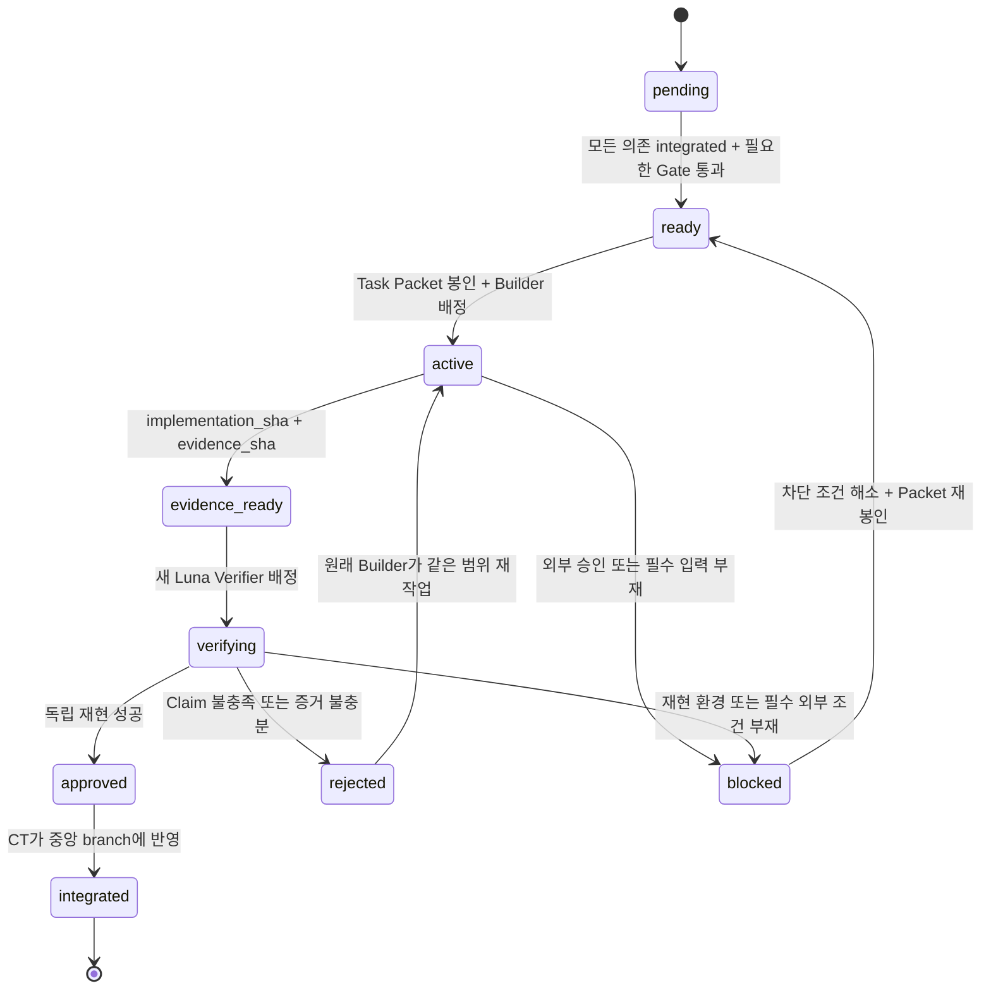

# Language Assistant 검증 가능 AI 개발 Control Tower 설계

## 1. 문서 상태

- **작성일:** 2026-08-02
- **상태:** 사용자 승인 완료, 구현 계획 반영 완료
- **대상 저장소:** `fowoco/ai`
- **대상 기능:** E-9 외국인근로자용 Language Assistant LangGraph
- **구현 상태:** T01~T16 전체 구현 및 검증 완료 (W5 T16)
- **목적:** T0–T16 구현을 비용 통제 가능한 다중 세션으로 수행하면서, 모든 완료 주장을 독립적으로 재현하고 사용자가 직접 승인할 수 있게 한다.

이 문서는 기능 설계를 다시 정의하지 않는다. 다음 두 문서에 실행 통제 계층을 추가한다.

1. `docs/engineering/specs/2026-08-02-language-assistant-graph-design.md`
2. `docs/engineering/plans/2026-08-02-language-assistant-graph.md`

충돌 시 적용 순서는 다음과 같다.

1. Language Assistant 기능·데이터 계약은 Graph 설계 문서가 우선한다.
2. Task의 기술적 구현 내용은 T0–T16 구현 계획이 우선한다.
3. 세션 역할, 검증, Gate, 브랜치, 통합, 증거 기록은 이 문서가 우선한다.

이 문서는 기존 구현 계획의 다음 부분을 대체하거나 수정한다.

- 기존 `## 6. Recommended Execution Mode`를 `## 6. Approved Execution Mode`와 이 문서의 Control Tower 방식으로 대체한다.
- T0의 검토 문서 반입 범위를 기존 2개에서 이 문서를 포함한 3개로 확장한다.
- T9, T10, T11의 공유 파일 소유권을 병렬 실행이 가능하도록 조정한다.
- 기존 G1–G7 외부 통합 Gate는 제거하지 않고 그대로 유지한다.

## 2. 해결하려는 문제

이 프로젝트의 목표는 단순히 AI가 코드를 많이 생성하는 것이 아니다. 다음 네 가지를 동시에 만족해야 한다.

1. **납품 가능성:** 담당 범위를 실제 동작하는 코드와 테스트로 완성한다.
2. **검증 가능성:** 각 완료 주장을 동일한 commit에서 제3자가 재현할 수 있다.
3. **통제 가능성:** 범위 변경, 실패 수용, 다음 단계 진입을 사용자가 결정한다.
4. **비용 통제:** 저비용 구현 모델을 주력으로 사용하고 고비용 검토 모델은 고위험 경계에만 사용한다.

사용자가 기르려는 핵심 역량은 다음 질문에 스스로 답할 수 있는 능력이다.

- 지금 AI가 무엇을 구현한다고 약속했는가?
- 어떤 테스트와 실행 결과가 그 약속을 증명하는가?
- 무엇은 아직 증명되지 않았는가?
- 실패했을 때 어디까지 되돌릴 수 있는가?
- 다음 작업을 시작해도 되는 근거는 무엇인가?

## 3. 범위와 비범위

### 3.1 이 문서가 정의하는 것

- Luna, Sol, 사용자 사이의 역할 분리
- Wave 단위 Control Tower 세션 구조
- Task Packet, Evidence Pack, Review Packet 계약
- Luna Builder와 Luna Verifier의 분리
- Sol Review Gate와 추가 호출 조건
- Task 상태 전이와 다음 Wave 개방 조건
- `feat/language-assistant` 중심의 브랜치·worktree·통합 전략
- 동시 작업의 파일 소유권 규칙
- 실패, 거절, 재작업, 세션 중단, 예산 부족 처리
- 포트폴리오에 남길 검증 증거 구조

### 3.2 이 문서가 정의하지 않는 것

- Language Assistant의 기능 계약 변경
- `request_context` 외 사실원천 추가
- 모델 제공자, Qdrant 설정, 평가 기준의 임의 확정
- 메시지 발송 기능
- G1–G7에서 요구하는 팀·조직 차원의 승인 대행
- Sol이 직접 코드를 작성하거나 수정하는 절차
- AI 결과를 사람의 승인 없이 production에 배포하는 절차

## 4. 핵심 용어

| 용어 | 정의 |
|---|---|
| Task | 기존 구현 계획의 T0–T16 중 하나인 최소 검증 단위 |
| Wave | 서로 의존하는 Task를 하나의 통제 구간으로 묶은 실행 단위 |
| Control Tower | Task Packet 봉인, 상태 전이, 증거 확인, 통합 순서를 관리하는 논리적 역할 |
| Builder | Task를 test-first로 구현하고 Evidence Pack을 만드는 Luna 세션 |
| Verifier | Builder의 대화 내용을 상속받지 않고 같은 commit을 재현 검증하는 새 Luna 세션 |
| Reviewer | 고위험 Wave 경계에서 반례와 미증명 위험만 검토하는 Sol 세션 |
| Gate | 다음 Wave 진입 전에 사용자가 증거를 확인하고 결정하는 경계 |
| `base_sha` | Task branch가 시작한 승인된 통합 commit |
| `packet_sha` | Control Tower가 Task branch에 Task Packet만 봉인한 docs-only commit |
| `implementation_sha` | Builder가 코드와 테스트만 확정한 Task commit |
| `evidence_sha` | `implementation_sha`를 참조하는 Evidence Pack만 추가한 docs-only commit |
| `merge_sha` | 승인된 Task branch 전체를 중앙 branch에 합류시킨 `--no-ff` merge commit |
| `integrated_sha` | merge 결과와 ledger 갱신을 중앙 branch에 반영한 뒤의 commit |
| Claim | 해당 Task가 사실이라고 주장하는 검증 가능한 문장 |
| Evidence | Claim을 뒷받침하는 명령, 종료 코드, 결과, diff, commit 정보 |

## 5. 절대 불변 조건

다음 조건은 Control Tower가 편의를 위해 완화할 수 없다.

1. 채팅의 완료 주장은 실행 상태가 아니다. 저장소에 기록된 ledger와 exact SHA만 상태다.
2. 모든 Task는 봉인된 Task Packet 없이 시작할 수 없다.
3. Builder가 검증한 자기 결과만으로 Task를 승인할 수 없다.
4. Verifier는 Builder의 채팅 문맥을 상속받지 않는 새 Luna 세션이어야 한다.
5. Verifier와 Sol은 코드를 수정하지 않는다.
6. 실패한 Task는 원래 Builder에게 돌아간다.
7. `packet_sha`, `implementation_sha`, `evidence_sha` 중 하나라도 바뀌면 이전 검증 결과는 무효다.
8. 의존 Task가 중앙 branch에 통합되기 전에는 후속 Task를 시작할 수 없다.
9. Sol Gate가 필요한 Wave는 사용자 승인 전까지 다음 Wave를 열 수 없다.
10. 동시에 실행하는 Builder는 최대 2개다.
11. 동시에 실행하는 Task는 수정 허용 파일이 겹치면 안 된다.
12. 기존 HWPX dirty worktree와 무관한 사용자 변경은 건드리지 않는다.
13. API key, 개인정보, 원문 EPS 본문, 전체 Prompt·Response를 증거 문서에 기록하지 않는다.
14. G1–G7이 열려 있으면 해당 production 주장을 하지 않는다.
15. 실행하지 않은 테스트와 측정하지 않은 품질은 완료로 표시하지 않는다.

## 6. 모델과 역할 배정

### 6.1 고정 배정

| 역할 | 모델 | 추론 강도 | 쓰기 권한 | 세션 수명 |
|---|---|---:|---|---|
| Wave Control Tower | Luna | 매우 높음 | 문서·통합 작업만 | Wave마다 새 세션 |
| Task Builder | Luna | 매우 높음 | 배정된 Task 파일만 | Task 승인 또는 중단까지 |
| Task Verifier | Luna | 매우 높음 | 없음 | SHA 묶음당 새 세션 |
| Risk Reviewer | Sol | Gate별 높음 또는 매우 높음 | 없음 | Gate당 새 세션 |
| 최종 결정자 | 사용자 | 해당 없음 | 승인·보류·반려 권한 | 전체 프로젝트 |

Terra는 사용하지 않는다. 구현은 모두 Luna가 담당하며 Sol은 검토자로만 참여한다.

### 6.2 논리적 Control Tower와 물리적 세션

Control Tower는 하나의 영구 채팅이 아니다. 논리적으로는 하나지만 물리적으로는 다음처럼 Wave마다 새 Luna 세션을 사용한다.

```text
CT-W0 → CT-W1 → CT-W2 → CT-W3 → CT-W4 → CT-W5
```

각 세션은 이전 채팅 기억이 아니라 다음 저장소 증거에서 상태를 복원한다.

- Control Tower ledger
- 승인된 설계·구현 계획
- Task별 Task Packet과 Evidence Pack
- Gate별 Sol Review 기록
- Git branch, worktree, exact commit SHA

이 구조는 긴 세션의 문맥 손실을 방지하고, 특정 모델 세션이 사라져도 작업을 재개할 수 있게 한다.

### 6.3 Sol의 제한

Sol은 다음 세 질문에만 집중한다.

1. 이 Claim을 깨는 반례가 있는가?
2. 제시된 테스트가 요구사항을 실제로 증명하는가?
3. 다음 Wave를 열지 말아야 할 이유가 있는가?

Sol이 하지 않는 일은 다음과 같다.

- 구현 코드 작성 또는 수정
- 테스트 고치기
- merge conflict 해결
- Task branch 소유
- 전체 저장소에 대한 무제한 감사
- Luna 결과를 대신 실행 상태로 확정
- 사용자 대신 Gate 승인

## 7. Wave와 Gate 구조

```mermaid
flowchart LR
    W0["W0 · T0\n격리와 장부 준비"] --> W1["W1 · T1 → T2 ∥ T3\n계약과 사실 경계"]
    W1 --> S1{{"S1 · Sol 높음"}}
    S1 -->|"사용자 승인"| W2["W2 · T4 → T5 → T6\nRetrieval stack"]
    W2 --> S2{{"S2 · Sol 매우 높음"}}
    S2 -->|"사용자 승인"| W3["W3 · T7 → T8 → T9 ∥ T10 → T11 → T12\n생성·검증·Graph·API"]
    W3 --> S3{{"S3 · Sol 높음"}}
    S3 -->|"사용자 승인"| W4["W4 · T13 → T14\nRuntime·Privacy·Resilience"]
    W4 --> S4{{"S4 · Sol 매우 높음"}}
    S4 -->|"사용자 승인"| W5["W5 · T15 → T16\n평가·최종 검증"]
    W5 --> S5{{"S5 · Sol 매우 높음"}}
    S5 -->|"사용자 승인"| DONE["완료 후보\nPR 검토 가능"]
```



`∥`는 병렬 실행 가능성을 뜻하며 자동 병렬 실행을 뜻하지 않는다. Control Tower가 파일 소유권, base SHA, 가용 Builder 수를 확인한 뒤에만 두 Task를 동시에 `active`로 바꾼다.

### 7.1 Wave별 실행표

| Wave | Task 순서 | 핵심 Claim | Sol Gate | Gate 추론 강도 |
|---|---|---|---|---:|
| W0 | T0 | 원본 dirty worktree를 보존한 격리 환경과 ledger가 존재한다. | 없음 | 해당 없음 |
| W1 | T1 → T2 ∥ T3 | 입력 계약, 언어 정규화, `request_context` 사실권한, protected fact, query 보존이 닫힌다. | S1 | 높음 |
| W2 | T4 → T5 → T6 | EPS 데이터와 Qdrant retrieval이 재현 가능한 provenance와 degradation 정책을 가진다. | S2 | 매우 높음 |
| W3 | T7 → T8 → T9 ∥ T10 → T11 → T12 | 생성·검증 branch가 격리되고 병렬 Graph와 내부 API 계약이 성립한다. | S3 | 높음 |
| W4 | T13 → T14 | runtime, privacy, fault isolation, 복구 경계가 production 오해 없이 검증된다. | S4 | 매우 높음 |
| W5 | T15 → T16 | 측정 범위와 미측정 범위를 구분한 최종 검증·handoff가 재현된다. | S5 | 매우 높음 |

### 7.2 Gate가 닫혀 있을 때

Gate 결과는 다음 셋 중 하나다.

| 결과 | 의미 | 다음 행동 |
|---|---|---|
| `approve` | 다음 Wave를 열 수 있다. | 사용자가 `진행`을 결정하면 다음 CT 세션을 시작한다. |
| `conditional` | 조건을 증명하기 전에는 열 수 없다. | 원래 Builder가 조건을 처리하고 새 SHA로 재검증한다. |
| `reject` | 핵심 Claim이 증명되지 않았다. | 관련 Task를 `rejected`로 되돌리고 재작업한다. |

Sol의 `approve`는 사용자 승인을 대체하지 않는다. Sol Review가 끝난 뒤 사용자는 다음 중 하나를 결정한다.

- **진행:** Gate 승인 기록을 남기고 다음 Wave를 연다.
- **반려:** 지정한 Task로 되돌린다.
- **보류:** 현 상태와 미해결 항목을 ledger에 고정하고 작업을 멈춘다.

## 8. Task 상태 기계

허용 상태는 다음과 같다.

```text
pending | ready | active | evidence_ready | verifying
| rejected | approved | integrated | blocked
```



상태는 Control Tower만 변경한다. Builder, Verifier, Sol은 판정 자료를 만들지만 ledger 상태를 직접 확정하지 않는다.

### 8.1 상태 전이의 증거 조건

| 전이 | 필수 증거 |
|---|---|
| `pending → ready` | 모든 dependency의 `integrated_sha`, 필요한 이전 Gate 승인 |
| `ready → active` | `packet_sha`, `base_sha`, branch, worktree, Builder 세션 식별자 |
| `active → evidence_ready` | clean Task worktree, `implementation_sha`, `evidence_sha`, Evidence Pack |
| `evidence_ready → verifying` | 새 Verifier 세션, 검증 대상 SHA 고정 |
| `verifying → approved` | 필수 명령 재실행, Claim별 verdict, 미검증 목록 |
| `verifying → rejected` | 실패한 Claim, 재현 명령, 기대값과 실제값 |
| `approved → integrated` | 중앙 branch의 `merge_sha`, ledger 갱신 후 `integrated_sha` |
| `* → blocked` | 차단 원인, 해제 조건, 안전한 재개 지점 |

## 9. Task Packet 계약

Task Packet은 Builder에게 주는 실행 계약이다. Control Tower는 Task branch를 `base_sha`에서 만든 직후 Packet만 담은 docs-only commit을 생성한다. 그 commit이 `packet_sha`다. Builder는 `packet_sha`부터 작업한다. 봉인 뒤 내용을 변경해야 하면 새 version을 만들고 기존 Packet을 폐기 표시한다.

권장 최소 구조는 다음과 같다.

```yaml
packet_version: 1
wave: W3
task: T09
title: Easy Korean subgraph
status: sealed

claim:
  - Easy Korean branch only uses its narrow input contract.
  - Every protected request fact is preserved or a typed warning is returned.

source_authority:
  design_doc: docs/engineering/specs/2026-08-02-language-assistant-graph-design.md
  implementation_plan: docs/engineering/plans/2026-08-02-language-assistant-graph.md
  control_tower_doc: docs/engineering/specs/2026-08-02-language-assistant-control-tower-design.md

git:
  integration_branch: feat/language-assistant
  base_sha: <exact approved integrated SHA>
  packet_sha: <Control Tower가 commit 후 ledger에 기록; Packet 본문에는 사후 기입하지 않음>
  task_branch: task/la-t09-easy-korean
  worktree: <absolute validated path>

dependencies:
  - task: T08
    integrated_sha: <sha>

scope:
  allowed_files: []
  forbidden_files: []
  forbidden_behavior: []

acceptance:
  claims: []
  required_failing_tests: []
  required_passing_commands: []

evidence_required:
  - failing-test output before implementation
  - passing focused tests after implementation
  - changed-file list
  - clean-worktree result
  - unrun and unverified list
  - rollback description

stop_conditions:
  - required contract is ambiguous
  - an allowed file outside the Packet must change
  - unrelated user changes are present in the Task worktree
  - external or destructive action becomes necessary
```

### 9.1 Packet 봉인 규칙

봉인 전에 Control Tower가 확인할 항목은 다음과 같다.

- Task의 모든 dependency가 `integrated`인가?
- Packet의 `base_sha`가 중앙 branch의 승인된 HEAD와 같은가?
- 수정 허용 파일이 동시 `active` Task와 겹치지 않는가?
- acceptance가 실행 가능한 테스트 이름과 명령으로 표현되어 있는가?
- 외부 Gate가 열려 있다면 fake/contract 범위와 production 비범위가 구분되어 있는가?
- 개인정보나 secret이 Packet에 포함되지 않았는가?
- 실패 시 되돌아갈 commit이 분명한가?

Packet 파일은 자기 자신을 담은 commit SHA를 스스로 기록할 수 없으므로 `packet_sha`는 Task 본문을 사후 수정하지 않고 Control Tower ledger에 기록한다. Packet이 봉인된 뒤 범위 확대가 필요하면 Builder는 임의로 진행하지 않고 `scope_change_requested`를 Evidence Pack의 deviation에 기록하고 멈춘다.

## 10. Builder 실행 계약

Builder는 다음 순서로 작업한다.

1. branch HEAD가 `packet_sha`인지, 그 parent가 `base_sha`인지, worktree가 clean인지 확인한다.
2. 관련 설계 문서와 Packet만 읽고 Claim을 자신의 말로 다시 적는다.
3. Packet에 명시된 실패 테스트를 먼저 작성·실행한다.
4. 실패가 요구사항 때문에 발생했는지 확인한다.
5. 허용 파일 안에서 최소 구현을 한다.
6. focused test를 통과시킨다.
7. Packet이 요구한 회귀·lint 명령을 실행한다.
8. diff와 scope를 감사한다.
9. 코드와 테스트만 담은 Task commit을 만들고 이를 `implementation_sha`로 확정한다.
10. `implementation_sha`를 참조하는 Evidence Pack을 작성한다.
11. Evidence Pack만 담은 docs-only commit을 만들고 이를 `evidence_sha`로 확정한다.
12. branch HEAD가 `evidence_sha`이며 worktree가 clean인지 확인한다.

Builder가 절대 하면 안 되는 일은 다음과 같다.

- Packet에 없는 기능을 선제 구현
- 다른 Task의 파일을 함께 정리
- 실패한 테스트를 삭제하거나 의미를 약화
- 외부 Gate가 없는 값을 임의 확정
- Verifier 역할을 자신의 세션에서 대체
- 관련 없는 dirty 변경을 stash, reset, checkout, 삭제
- 실패를 숨기고 `approved` 또는 `done`으로 표현

## 11. Evidence Pack 계약

Evidence Pack은 설명문이 아니라 재현 안내서다. 각 Claim은 적어도 하나의 실행 증거와 연결되어야 한다.

```yaml
evidence_version: 1
wave: W3
task: T09
packet_version: 1

git:
  base_sha: <sha>
  packet_sha: <sha>
  implementation_sha: <sha>
  branch: task/la-t09-easy-korean
  clean_worktree: true
  changed_files: []

claims:
  - id: T09-C01
    statement: <검증 가능한 문장>
    tests: []
    commands: []
    result: supported

commands:
  - command: <exact command>
    working_directory: <path>
    exit_code: 0
    result_summary: <비민감 요약>
    output_artifact: <optional repository-relative path>

scope_audit:
  allowed_files_only: true
  unexpected_files: []

deviations: []
unrun: []
unverified: []
rollback:
  safe_point: <base_sha>
  method: <비파괴적 복구 설명>
```

Evidence Pack은 `implementation_sha`가 확정된 다음 작성하고 별도 docs-only commit으로 저장한다. 이렇게 해야 Evidence Pack이 자기 commit SHA를 본문에 넣는 순환 참조를 피할 수 있다. `evidence_sha`는 그 commit이 만들어진 뒤 Control Tower ledger에 기록한다. Evidence commit에 코드나 테스트 변경이 섞이면 검증을 시작하지 않고 `rejected`로 돌린다.

### 11.1 좋은 증거와 나쁜 증거

| 좋은 증거 | 나쁜 증거 |
|---|---|
| exact SHA에서 실행한 명령과 종료 코드 | “테스트가 잘 됩니다” |
| 실패 테스트가 구현 전 실패한 이유 | 구현 후 테스트 결과만 제시 |
| Claim과 테스트 이름의 명시적 연결 | 테스트 개수만 제시 |
| 실행하지 않은 항목의 목록 | 암묵적으로 전부 검증되었다고 표현 |
| reference ID와 redacted fixture | 원문 개인정보 또는 전체 LLM 응답 |
| 재현 가능한 환경·revision 정보 | “최신 모델” 같은 변동 표현 |

## 12. Luna Verifier 계약

Verifier는 Builder와 같은 모델 계열을 쓰더라도 독립적인 세션과 역할 분리로 자기확증을 줄인다.

### 12.1 독립성 조건

- Builder 채팅을 fork하거나 그대로 전달하지 않는다.
- Task Packet, Evidence Pack, 설계 문서, exact commit만 제공한다.
- Builder가 요약한 성공 설명보다 저장소 상태를 먼저 확인한다.
- 쓰기 작업을 하지 않는다.
- 테스트 실패 시 고치지 않고 재현 정보만 남긴다.

### 12.2 검증 순서

1. branch HEAD가 `evidence_sha`이고 그 이력에 `packet_sha`와 `implementation_sha`가 순서대로 존재하는지 확인한다.
2. worktree가 clean인지 확인한다.
3. `base_sha..implementation_sha`의 코드·테스트 diff가 허용 파일에 한정되는지 확인한다.
4. `implementation_sha..evidence_sha`가 해당 Evidence Pack 문서만 변경했는지 확인한다.
5. Task Packet의 acceptance와 실제 테스트를 역추적한다.
6. Evidence Pack의 명령을 `evidence_sha`의 새 프로세스에서 재실행한다.
7. 적어도 하나의 경계값·반례를 독립적으로 확인한다.
8. Claim별 `supported`, `unsupported`, `inconclusive`를 기록한다.
9. 실행하지 못한 항목과 그 이유를 기록한다.
10. `approve`, `reject`, `blocked` 중 하나를 Control Tower에 반환한다.

### 12.3 Verifier 판정 기준

| 판정 | 조건 |
|---|---|
| `approve` | 모든 필수 Claim이 supported이고, 필수 명령이 통과하며, scope 위반이 없다. |
| `reject` | 필수 Claim 하나 이상이 unsupported이거나 테스트·scope를 우회했다. |
| `blocked` | 필수 외부 환경 또는 승인 부재로 결론을 낼 수 없다. |

`inconclusive`가 필수 Claim에 남아 있으면 `approve`할 수 없다. 선택적·production Claim에만 남는다면 해당 Claim을 `unverified`로 낮추고 Core Task의 승인 가능 여부를 별도로 판단한다.

## 13. Sol Review Gate 계약

Sol에는 전체 작업 기록을 무차별적으로 넘기지 않는다. Gate의 위험 경계와 exact SHA만 담은 Review Packet을 제공한다.

```yaml
gate: S2
reasoning_effort: very_high
review_mode: read_only
target:
  integration_branch: feat/language-assistant
  integrated_sha: <sha>
  tasks: [T04, T05, T06]

claims_under_review: []
evidence_index: []
known_unverified: []
external_gates_open: []

questions:
  - What counterexample breaks a claim?
  - Do the tests prove the stated requirement?
  - Is there a reason not to open the next wave?

prohibited_actions:
  - modify files
  - create commits
  - resolve conflicts
  - broaden scope without a concrete risk
```

### 13.1 다섯 개의 기본 Sol 호출

| Gate | 검토 범위 | 중점 위험 | 강도 |
|---|---|---|---:|
| S1 | T1–T3 | 입력 계약, 사실권한, 언어 매핑, query의 날짜·수치·고유명사 보존 | 높음 |
| S2 | T4–T6 | Qdrant schema, Dense+Sparse, RRF, reranking, model revision, index provenance | 매우 높음 |
| S3 | T7–T12 | bounded retry, branch 격리, 병렬 state write, fallback, API projection | 높음 |
| S4 | T13–T14 | secret·PII 노출, prompt injection 경계, fault isolation, recovery | 매우 높음 |
| S5 | T15–T16 | 평가 누수, 측정 과장, reproducibility, rollback·handoff 완결성 | 매우 높음 |

낮음·중간 강도는 사용하지 않는다. 최대·울트라 강도도 기본값으로 사용하지 않는다.

### 13.2 추가 Sol 호출 조건

기본 다섯 번 외 Sol 호출은 자동으로 열지 않는다. 다음 조건 중 하나가 발생하고 사용자가 명시적으로 승인할 때만 추가한다.

- 승인된 입력·출력 계약이 변경됨
- LangGraph state, edge, retry semantics가 변경됨
- Qdrant alias, schema, index provenance, model revision 정책이 변경됨
- privacy, auth, logging, secret 범위가 변경됨
- Luna Verifier가 같은 핵심 Claim을 반복해서 반려함
- 테스트가 비결정적이며 원인이 격리되지 않음
- 허용되지 않은 공유 파일 변경이 발견됨
- Gate 승인 뒤 통합 SHA가 다시 변경됨

## 14. 사용자 Control Gate

사용자는 각 Sol Gate에서 다음 세 문장을 직접 작성하거나 확인한다.

1. **우리가 증명하려는 Claim은 무엇인가?**
2. **어떤 실행 결과가 그 Claim을 증명하는가?**
3. **아직 증명되지 않은 것은 무엇인가?**

Control Tower는 이 답을 Gate 기록에 저장한다. 이 과정의 목적은 사용자가 AI의 결론을 수동 수용하는 것이 아니라, Claim과 Evidence 사이의 연결을 직접 설명할 수 있게 하는 것이다.

### 14.1 사용자에게 반드시 다시 묻는 경우

- 다음 Sol Gate 통과 후 다음 Wave를 열 때
- Task 범위를 확대하거나 기존 계약을 변경할 때
- destructive action, 외부 배포, 외부 메시지, production alias 전환이 필요할 때
- `conditional` 또는 `reject`를 수용할지 결정할 때
- G1–G7 조직 증거를 닫을 때
- 추가 Sol 호출로 비용을 사용할 때

### 14.2 사용자 승인 없이 진행 가능한 경우

- 같은 Wave 안에서 이미 승인된 dependency를 따라 다음 Task Packet을 봉인
- 실패한 필수 테스트를 원래 Builder에게 되돌림
- read-only 상태 확인과 재현 테스트
- Evidence Pack 형식 오류 보완
- 합의된 순서의 승인 Task branch를 중앙 branch에 `--no-ff` merge

단, 이 자동 진행은 외부 상태 변경이나 destructive action 권한을 확대하지 않는다.

## 15. 브랜치와 worktree 전략

### 15.1 중앙 branch

```text
develop
  └─ feat/language-assistant
       ├─ task/la-t01-domain-contracts
       ├─ task/la-t02-language-normalization
       ├─ task/la-t03-facts-and-queries
       └─ ...
```

- 중앙 통합 branch는 `feat/language-assistant`다.
- T0에서 최신 승인된 `origin/develop` 기준으로 격리 worktree와 중앙 branch를 준비한다.
- T1–T16은 각각 별도 Task branch와 별도 worktree를 사용한다.
- 최종 PR 방향은 `feat/language-assistant → develop`이다.

`feat/language-assistant/t01-...` 형태는 쓰지 않는다. Git ref 저장 방식상 `feat/language-assistant`가 이미 branch 파일이면 그 아래를 디렉터리형 branch로 만들 수 있기 때문이다.

### 15.2 Task branch 이름

| Task | Branch |
|---|---|
| T1 | `task/la-t01-domain-contracts` |
| T2 | `task/la-t02-language-normalization` |
| T3 | `task/la-t03-facts-and-queries` |
| T4 | `task/la-t04-retrieval-domain` |
| T5 | `task/la-t05-eps-index-plan` |
| T6 | `task/la-t06-hybrid-retrieval` |
| T7 | `task/la-t07-generation-resources` |
| T8 | `task/la-t08-validation-retry` |
| T9 | `task/la-t09-easy-korean` |
| T10 | `task/la-t10-native-translation` |
| T11 | `task/la-t11-graph-assembly` |
| T12 | `task/la-t12-internal-api` |
| T13 | `task/la-t13-runtime-qdrant` |
| T14 | `task/la-t14-privacy-resilience` |
| T15 | `task/la-t15-evaluation` |
| T16 | `task/la-t16-verification-handoff` |

명명 규칙은 `task/<component>-tNN-<검증 가능한 결과>`다. `work/`보다 Task 목적과 추적성이 명확한 `task/`를 사용한다.

### 15.3 Task 시작 기준

각 Task branch는 다음 조건에서 만든다.

1. 중앙 branch의 현재 HEAD가 승인된 `integrated_sha`인지 확인한다.
2. dependency와 이전 Gate가 닫혔는지 확인한다.
3. 그 SHA를 `base_sha`로 고정하고 Task branch와 worktree를 만든다.
4. 생성 직후 clean status와 HEAD가 `base_sha`인지 확인한다.
5. Control Tower가 Task Packet만 추가해 `packet_sha`를 만든다.
6. branch HEAD가 `packet_sha`이고 worktree가 clean일 때만 Builder를 배정한다.

병렬 Task는 동일한 승인 base에서 시작한다. 예를 들어 T2와 T3은 T1이 통합된 같은 SHA에서 출발한다.

### 15.4 통합 방식

Control Tower는 Luna Verifier가 승인한 Task branch 전체를 중앙 branch에 **`--no-ff` merge**한다. `packet_sha → implementation_sha → evidence_sha`는 원래 SHA 그대로 중앙 branch의 조상이 되며, Task별 merge commit이 별도로 생긴다.

이유는 다음과 같다.

- Task에서 만든 개별 commit과 Evidence Pack의 SHA를 그대로 보존한다.
- merge commit의 두 parent를 통해 Task branch의 분기와 합류를 그래프로 확인할 수 있다.
- Task별 변경 경계와 승인 시점을 명확하게 남긴다.
- 실패한 중간 상태가 아니라 검증이 끝난 branch 전체만 통합한다.
- 포트폴리오와 감사 기록에서 Task branch, Evidence SHA, merge commit을 연결할 수 있다.

기본 명령 형태는 다음과 같다.

```bash
git switch feat/language-assistant
git merge --no-ff task/la-t09-easy-korean \
  -m "merge: integrate T09 easy Korean"
```

다음 방식은 사용하지 않는다.

- **Squash merge:** 여러 Task commit을 새 commit 하나로 합쳐 원래 commit graph와 SHA 연결을 잃는다.
- **Rebase and merge:** commit을 다시 생성해 검증받은 SHA를 바꾼다.
- **Fast-forward only:** 개별 commit은 남지만 Task가 합류한 명시적 merge 경계가 남지 않는다.

Git의 branch 이름은 commit 자체가 아니라 움직일 수 있는 ref다. Task branch를 나중에 삭제하면 `git branch` 목록의 이름은 사라지지만 commit과 merge graph는 남는다. 이름까지 장기 추적할 수 있도록 다음 두 곳에 반드시 기록한다.

- merge commit 제목 또는 본문의 `Task-Branch: task/la-tNN-...`
- Control Tower ledger의 `task_branch`와 `merge_sha`

병렬 Task의 결정적 통합 순서는 다음과 같다.

- W1: T2 후 T3
- W3: T9 후 T10

두 Task는 파일 소유권이 겹치지 않아야 한다. 통합 충돌이 발생하면 Control Tower가 직접 고치지 않는다.

1. 원래 Builder에게 Task branch를 돌려보낸다.
2. Builder가 최신 중앙 branch를 Task branch에 merge하고 충돌을 해결한다. rebase는 사용하지 않는다.
3. Builder가 전체 Task 테스트와 Evidence Pack을 다시 만든다.
4. 바뀐 HEAD에 대해 새 Luna Verifier를 배정한다.
5. 승인 후 `--no-ff` merge를 다시 시도한다.

### 15.5 로컬·원격·PR 정책

- Task branch와 worktree는 로컬에서 시작한다.
- Luna Verifier는 Task branch의 exact `evidence_sha`를 검증한다.
- 승인된 Task branch는 로컬 `feat/language-assistant`에 `--no-ff` merge한다.
- `feat/language-assistant`는 S1–S5 Gate마다 `origin`에 push한다.
- Task branch를 별도로 원격 push하거나 Task별 PR을 만드는 것은 기본 절차가 아니다. 팀 CI나 사람 검토가 필요할 때만 추가한다.
- `feat/language-assistant`가 push되면 merge된 Task commit도 그 history의 조상으로 원격에 함께 올라간다.
- S5와 최종 handoff 전까지 로컬 Task branch ref를 유지한다. 이후 삭제하더라도 commit graph와 ledger 기록은 남는다.
- 최종 PR은 `feat/language-assistant → develop` 하나다.
- 최종 PR도 **Create a merge commit** 방식을 사용하며 Squash and merge와 Rebase and merge는 사용하지 않는다.

## 16. 병렬성 및 파일 소유권

### 16.1 전역 규칙

- 동시 `active` Builder는 최대 2개다.
- read-only Verifier나 Sol Reviewer는 Builder 파일을 수정하지 않는다.
- 같은 파일을 수정할 가능성이 있으면 논리적으로 독립적이어도 순차 실행한다.
- 공유 기반 파일은 더 이른 공통 Task 또는 더 늦은 조립 Task가 단독 소유한다.
- 예상하지 못한 공유 파일 수정이 필요하면 즉시 중단하고 Packet을 재검토한다.

### 16.2 T9·T10 병렬화를 위한 소유권 변경

기존 구현 계획은 T9와 T10 모두 `state.py`, `nodes.py`를 수정하게 되어 있어 그대로는 안전하게 병렬 실행할 수 없다. 다음처럼 변경한다.

| Task | 허용되는 핵심 구현 파일 | 금지되는 공유 파일 |
|---|---|---|
| T9 | `app/agents/language/easy_korean.py`, `tests/agents/language/test_easy_korean.py` | `state.py`, `nodes.py`, Graph 조립 파일 |
| T10 | `app/agents/language/translation.py`, `app/agents/language/retrieval/service.py`, `tests/agents/language/test_translation.py`, 필요한 retrieval 전용 테스트 | `state.py`, `nodes.py`, Graph 조립 파일 |
| T11 | `state.py`, `nodes.py`, `graph.py`, `service.py`, `projection.py`, `__init__.py`, Graph 조립 테스트 | T9·T10 내부 알고리즘의 재설계 |

구체적인 전환은 다음과 같다.

- T9의 branch-local state와 output 모델은 `easy_korean.py` 안에 둔다.
- T10의 branch-local state와 output 모델은 `translation.py` 안에 둔다.
- T9와 T10은 각각 narrow input/output contract만 단독 테스트한다.
- `LanguageAssistantState`에 `easy_result`와 `translation_result`를 연결하는 일은 T11이 맡는다.
- Easy·Translation wrapper node와 fan-out/fan-in 조립도 T11이 맡는다.
- T11은 승인된 T9·T10 API를 연결하며 두 branch 내부 동작을 임의 변경하지 않는다.

이 변경은 기능 계약을 바꾸지 않고 작업 파일 충돌만 제거한다. 세부 구현 계획에는 사용자 문서 승인 후 반영한다.

## 17. Control Tower ledger

영구 실행 상태는 다음 구조에 기록한다.

```text
docs/engineering/
├─ specs/
│  ├─ 2026-08-02-language-assistant-graph-design.md
│  └─ 2026-08-02-language-assistant-control-tower-design.md
├─ plans/
│  └─ 2026-08-02-language-assistant-graph.md
├─ execution/language-assistant/
│  ├─ control-tower.md
│  ├─ tasks/
│  │  ├─ T01-domain-contracts.md
│  │  └─ ...
│  └─ reviews/
│     ├─ S1-contract-boundary.md
│     └─ ...
```

T0에서 `execution/` 뼈대를 만든다. 현재 설계 단계에서는 실행 결과를 미리 채우지 않는다. 개인 포트폴리오 원고는 팀 저장소에 commit하지 않는다. S5 이후 비식별화된 Evidence Pack을 바탕으로 사용자 소유 Notion 또는 개인 저장소에서 별도로 작성한다.

### 17.1 Control Tower ledger 필드

| 필드 | 의미 |
|---|---|
| `task` | T01–T16 식별자 |
| `title` | 검증 가능한 Task 결과 |
| `status` | 허용 상태 중 현재 값 |
| `base_sha` | Task 시작 SHA |
| `packet_sha` | 봉인된 Task Packet commit |
| `task_branch` | Task branch |
| `implementation_sha` | Builder 결과 SHA |
| `evidence_sha` | Evidence Pack docs-only commit |
| `merge_sha` | Task branch를 합류시킨 `--no-ff` merge commit |
| `integrated_sha` | ledger 갱신까지 포함한 중앙 반영 후 SHA |
| `dependencies` | 선행 Task와 요구 SHA |
| `luna_verdict` | 독립 Verifier 결과 |
| `sol_gate` | 적용 Gate와 결과 |
| `user_decision` | 진행·반려·보류 |
| `unverified` | 아직 증명되지 않은 항목 |

### 17.2 Task 기록 섹션

각 Task 문서는 다음 순서를 유지한다.

1. 목적과 Claim
2. dependency와 `base_sha`
3. 허용 파일과 금지 범위
4. 구현 전 실패 테스트
5. 구현 결과
6. exact 명령과 종료 코드
7. 변경 파일
8. 실행하지 않은 항목과 미검증 항목
9. rollback 지점
10. Luna Verifier 결과
11. 중앙 `integrated_sha`

### 17.3 Sol Review 기록 섹션

1. Gate와 대상 `integrated_sha`
2. 검토 Claim
3. 참조 Evidence Pack
4. 발견한 반례와 위험
5. `approve`, `conditional`, `reject` 판정
6. 조건 또는 반려 사유
7. 미검증 항목
8. 사용자 결정

## 18. 외부 G1–G7과 내부 S1–S5의 관계

S1–S5는 코드와 증거를 검토하는 내부 위험 Gate다. G1–G7은 팀·조직·데이터·운영 조건을 확인하는 외부 Gate다. 서로 대체하지 않는다.

| Gate | 필요한 외부 증거 | 막는 범위 |
|---|---|---|
| G1 | redacted request/response fixture, 필드·ID 타입 합의 | T12 HTTP route merge |
| G2 | LLM base URL, model, JSON 지원, credential 주입 방식 | T7 real adapter enablement |
| G3 | Easy Korean Context Pack 담당자 승인 | production Easy Korean enablement |
| G4 | 60개 retrieval case의 relevant Point ID/grade | threshold tuning, retrieval production release |
| G5 | 15개 언어 fluent reviewer 결과 | translation production release |
| G6 | 내부 API 보안 소유자·배포 정책 | endpoint production exposure |
| G7 | EPS 이용·보관 및 BGE 라이선스 검토 | production indexing/image release |

예를 들어 S3가 승인되어도 G2·G3·G5가 열려 있으면 generation 구조와 fake test만 검증된 것이다. 실제 provider 품질이나 15개 언어 production 준비가 완료되었다고 주장할 수 없다.

Control Tower ledger는 각 Task에서 다음을 분리 기록한다.

```text
core_implementation: verified | unverified
production_integration: verified | blocked_by[G...]
quality_measurement: measured | not_measured | blocked_by[G...]
```

## 19. 실패와 복구 정책

### 19.1 테스트 실패

- Verifier가 exact 명령과 실패 결과를 기록한다.
- Task 상태를 `rejected`로 바꾼다.
- 원래 Builder에게 같은 Packet과 반려 증거를 전달한다.
- Builder는 테스트를 약화하지 않고 원인을 수정한다.
- 새 commit과 Evidence Pack을 만든다.
- 새 Verifier 세션이 새 SHA를 처음부터 검증한다.

### 19.2 scope 위반

허용 파일 밖 변경이 발견되면 구현이 동작해도 승인하지 않는다.

- 변경이 불필요하면 원래 Builder가 자신의 Task 변경에서 제거한다.
- 변경이 필수라면 Control Tower가 dependency와 파일 소유권을 재설계한다.
- 사용자 승인을 받아 Packet version을 올린다.
- Sol 추가 호출 조건에 해당하면 호출 전에 사용자 승인을 받는다.

### 19.3 세션 종료 또는 문맥 손실

Builder가 중간에 종료되면 채팅을 복원하려 하지 않는다. 다음 항목만 안전한 checkpoint로 인정한다.

- clean 또는 명시적으로 설명된 worktree 상태
- 현재 branch와 HEAD
- 마지막 실행 명령과 결과
- 남은 acceptance 항목
- 미커밋 파일 목록
- secret·개인정보가 없는 handoff 기록

새 Builder는 ledger와 worktree를 read-only로 점검한 뒤 이어받을 수 있는지 판단한다. 설명되지 않은 변경이 있으면 작업을 계속하지 않고 `blocked`로 보고한다.

### 19.4 merge 충돌

Control Tower는 충돌을 해결하지 않는다. 충돌 Task의 원래 Builder가 최신 중앙 SHA에서 재작업하고 전체 Task 검증을 다시 받는다.

### 19.5 비결정적 테스트

- 단순 재실행만으로 성공 처리하지 않는다.
- seed, 시간, 외부 서비스, 병렬성, cache, 모델 revision을 분리한다.
- 원인이 격리될 때까지 Task는 `blocked` 또는 `rejected`다.
- 핵심 Gate에 영향을 주고 반복되면 추가 Sol 검토 후보로 사용자에게 보고한다.

### 19.6 Plus 사용량 또는 세션 예산 부족

예산 부족은 품질 기준을 낮추는 근거가 아니다.

1. 현재 Task의 상태와 exact SHA를 ledger에 기록한다.
2. 실행한 것과 실행하지 않은 것을 분리한다.
3. partial work를 `approved`로 표시하지 않는다.
4. 안전한 재개 지점을 남기고 `blocked` 또는 현재 상태에서 멈춘다.
5. 다음 세션은 채팅이 아니라 Task Packet과 저장소 증거로 재개한다.

## 20. 개인정보와 비용 통제

### 20.1 기록 금지 정보

- API key와 credential
- 실제 근로자 개인정보
- worker DB 전체 객체
- 사용자 원문 메시지의 비식별 처리되지 않은 값
- EPS 원문 전체 본문
- 전체 LLM Prompt와 Response
- 로컬 세션 접근 URL, token, 임시 browser key

필요한 경우 redacted fixture, hash, reference ID, schema, 길이, 종료 코드만 남긴다.

### 20.2 비용 통제 규칙

- 구현과 독립 재검증은 Luna 매우 높음으로 수행한다.
- Sol은 기본 다섯 Gate에서만 호출한다.
- Sol에게 Task별 전체 구현을 반복 설명하지 않고 Gate Packet만 제공한다.
- 같은 SHA를 같은 이유로 중복 검토하지 않는다.
- 추가 Sol 호출은 위험과 기대 효과를 사용자가 확인한 뒤에만 한다.
- 공개 포트폴리오에는 공식 출처와 날짜가 없는 정확한 가격 배수를 쓰지 않는다.
- 대신 **비용 비대칭을 이용한 계층형 모델 운영**으로 설명한다.

## 21. 포트폴리오 기록 설계

포트폴리오의 주제는 “AI가 구현했다”가 아니라 “AI 작업을 검증 가능하고 통제 가능하게 운영했다”다.

이 절은 포트폴리오의 내용 계약만 정의한다. 포트폴리오 원고와 개인 회고는 `fowoco/ai`에 저장하거나 원격 push하지 않는다. 팀 저장소에는 재현에 필요한 engineering evidence만 남긴다.

### 21.1 핵심 서사

1. 구조화 입력과 단일 사실원천을 계약으로 고정했다.
2. 강한 의존성을 Wave와 Gate로 나눴다.
3. 저비용 구현 모델과 고위험 검토 모델의 역할을 분리했다.
4. Builder와 Verifier를 분리해 자기확증을 줄였다.
5. Claim → Test → Result → Commit을 추적 가능하게 만들었다.
6. 실패·반려·재작업도 숨기지 않고 증거로 남겼다.
7. production 미검증 범위를 명시해 과장된 완료 주장을 막았다.

### 21.2 반드시 포함할 증거

- 전체 Wave/Gate 지도
- Task dependency와 branch 전략
- Task Packet 예시 1개
- 실패 테스트에서 통과 테스트로 바뀐 예시
- Builder Evidence Pack과 독립 Luna verdict 연결
- Sol이 발견한 반례 또는 조건부 승인 사례
- 사용자가 Gate에서 작성한 세 질문의 답
- `base_sha → packet_sha → implementation_sha → evidence_sha → integrated_sha` 추적 예시
- 실패 후 원래 Builder가 재작업한 사례
- G1–G7 때문에 production-ready로 주장하지 않은 항목
- 복구 또는 rollback을 실제로 확인한 결과

### 21.3 Claim 추적 표준

```text
Claim
  → 요구사항 문서 위치
  → 실패 테스트
  → 구현 파일
  → 통과 명령과 종료 코드
  → packet_sha
  → implementation_sha
  → evidence_sha
  → Luna Verifier 판정
  → integrated_sha
  → Sol Gate 판정
  → 사용자 결정
```

포트폴리오에는 검증되지 않은 성능 수치, 모델 우열, 15개 언어 품질을 쓰지 않는다. 측정 결과가 있을 때만 fixture, 평가 commit, 환경, 한계를 함께 공개한다.

## 22. Control Tower 세션 시작 Prompt 계약

각 CT-Wn 세션은 다음 정보를 받아 시작한다.

```text
역할: Language Assistant Wave Control Tower
모델: Luna
추론 강도: 매우 높음

읽을 문서:
- Graph design
- implementation plan
- Control Tower design
- execution/language-assistant/control-tower.md
- 현재 Wave의 Task/Evidence/Review 문서

반드시 먼저 확인:
- git status --short --branch
- git worktree list
- feat/language-assistant HEAD
- ledger의 integrated_sha
- 열린 외부 Gate와 unverified 항목

권한:
- Task Packet 봉인
- 최대 2개 Luna Builder 배정
- 새 Luna Verifier 배정
- 승인된 Task branch의 결정적 `--no-ff` merge
- ledger 갱신

금지:
- 코드 직접 구현
- Verifier 대신 실패 수정
- Sol 대신 Gate 판정
- 사용자 승인 없이 다음 Sol Gate 통과 처리
- 관련 없는 dirty worktree 수정
```

Control Tower 세션은 복원 점검 결과가 ledger와 다르면 새 Task를 시작하지 않는다. 차이를 먼저 `blocked` 또는 상태 불일치로 기록하고 사용자에게 알린다.

## 23. Task별 실행 요약

| Task | Builder 결과 | 독립 검증 핵심 | 통합 전 조건 |
|---|---|---|---|
| T0 | 격리 worktree, 중앙 branch, 문서·ledger | 원본 dirty 변경 보존, exact base | W0 점검 완료 |
| T1 | Domain contract, child state, projection, schemas | 입력 네 필드와 Parent Context 비침투 | T0 integrated |
| T2 | 15개 언어 정규화 | canonical, legacy alias, nationality fallback | T1 integrated |
| T3 | formatter, protected facts, 3 queries | `request_context` 단일 권한, 값 보존 | T1 integrated |
| T4 | retrieval models·ports·RRF | fusion 결정성, 모델 경계 | T2·T3 integrated |
| T5 | EPS cleaner·index plan | 재현 가능한 provenance | T4 integrated |
| T6 | BGE-M3·Qdrant·reranker adapter | revision, schema, degradation | T5 integrated |
| T7 | generation port·prompt·Context Pack | provider 격리, G2/G3 상태 | S2 승인, T6 integrated |
| T8 | validation·bounded correction | retry 상한, 마지막 후보 정책 | T7 integrated |
| T9 | Easy branch | 좁은 input, 사실 보존, fallback | T8 integrated |
| T10 | Translation branch·retrieval connection | EPS evidence, fallback, reference IDs | T8 integrated |
| T11 | shared state·nodes·parallel Graph | disjoint writes, fan-out/fan-in, partial failure | T9·T10 integrated |
| T12 | internal HTTP contract | G1 fixture, projection, no send | T11 integrated, G1 조건 확인 |
| T13 | runtime·Compose·preload·recovery | isolated Qdrant, exact revisions | T12 integrated |
| T14 | privacy·injection·fault isolation | PII/secret 비노출, branch 격리 | T13 integrated |
| T15 | retrieval·generation evaluation | 평가 track 분리, 미측정 명시 | T14 integrated |
| T16 | full verification·handoff | 전체 scope, recovery, rollback, dirty 보존 | T15 integrated |

표의 조건은 요약이며, 실제 dependency authority는 구현 계획의 DAG와 이 문서의 Gate 규칙을 함께 적용한다.

## 24. 설계 수용 기준

구현으로 넘어가기 전에 다음이 모두 확인되어야 한다.

- [x] 사용자가 Luna-only 구현과 Luna 독립 검증을 승인했다.
- [x] 사용자가 Sol read-only Gate 5회를 승인했다.
- [x] 모든 Luna 세션의 추론 강도가 매우 높음으로 고정되었다.
- [x] S1·S3은 높음, S2·S4·S5는 매우 높음으로 고정되었다.
- [x] 논리적 Control Tower는 Luna이며 CT-W0–W5가 새 세션으로 분리된다.
- [x] 최대 동시 Builder 수는 2개다.
- [x] 중앙 branch는 `feat/language-assistant`다.
- [x] Task branch는 `task/la-tNN-...` 규칙을 쓴다.
- [x] 승인 Task branch 전체를 `--no-ff` merge로 중앙 branch에 반영한다.
- [x] Task 통합과 최종 PR에서 Squash merge와 Rebase and merge를 사용하지 않는다.
- [x] 충돌은 Control Tower가 고치지 않고 원래 Builder에게 돌려보낸다.
- [x] T9·T10 공유 파일이 T11 소유로 이동한다.
- [x] 새 SHA는 새 Luna 검증을 요구한다.
- [x] Sol과 Verifier는 코드를 수정하지 않는다.
- [x] 사용자만 Gate의 최종 진행·반려·보류를 결정한다.
- [x] G1–G7 외부 Gate가 유지된다.
- [x] 포트폴리오는 Claim → Evidence → Commit 흐름과 미검증 범위를 함께 기록한다.
- [x] 현재 HWPX 작업과 구현 코드를 이 설계 단계에서 수정하지 않는다.

## 25. 승인 결과와 다음 순서

- [x] 실행 방식을 구현 계획의 `Approved Execution Mode`로 교체했다.
- [x] T0 반입 대상을 승인된 Language 문서 3개로 수정했다.
- [x] T0에 Control Tower ledger와 Task/Gate template 생성을 추가했다.
- [x] T9·T10·T11의 파일 목록과 단계 설명에 병렬 안전 소유권을 반영했다.
- [x] Task 통합을 branch 전체 `--no-ff` merge로 고정했다.
- [x] `docs/superpowers`를 팀용 `docs/engineering` 경로로 변경했다.
- [ ] 사용자가 갱신된 T0–T16 구현 계획을 검토하고 승인한다.
- [ ] 구현 계획 승인 후 CT-W0를 시작하고 T0만 실행한다.
- [ ] T0 증거와 원본 HWPX 보존을 확인한 뒤 W1로 이동한다.

현재 단계의 다음 사용자 결정은 다음과 같다.

> 갱신된 구현 계획이 승인된 Control Tower 설계를 정확히 반영하는지 검토하고, CT-W0 실행 여부를 결정한다.
