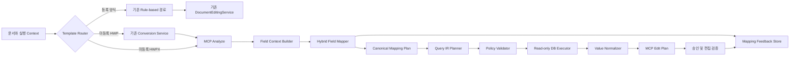

# Dynamic Document Automation 설계

- 작성일: 2026-08-11
- 상태: 승인됨
- 범위: 처음 보는 임의 HWP/HWPX 양식의 필드와 read-only DB 값을 자동 매핑
- 도입 방식: 기존 문서 생성 경로를 동결하고 신규 병렬 패키지로 확장

## 1. 배경

현재 시스템에는 서로 다른 세 가지 필드 이름 체계가 있다.

1. 업무 및 DB 슬롯: `full_name`, `nationality`, `stay_expiry_date`
2. 등록 템플릿 필드: `employee_name`, `foreign_name`, `employee_1_name`
3. MCP 동적 필드: 문서 좌표 기반 `field_id`, 라벨, 타입, 위치 정보

등록된 4종 양식은 `document_field_map.py`의 템플릿별 규칙과
`DocumentEditingService`로 처리한다. 이 경로는 안정된 기존 동작이므로 변경하지 않는다.

미등록 양식은 MCP가 입력 후보를 기계적으로 추출할 수 있지만, 현재 field registry에는
canonical field나 DB source 정보가 없다. 샘플 분석에서는 다음 문제도 확인됐다.

- 처리 절차 및 안내 문구가 입력 필드로 추출된다.
- 서로 다른 금액 칸이 동일한 `금액 입력 영역` 라벨을 갖는다.
- `성명`, `전화번호`, `사업자등록번호`가 여러 엔티티와 역할에 반복된다.
- 라벨만으로 매핑하면 근로자, 회사, 보증인, 학교 정보를 혼동할 수 있다.

따라서 동적 자동화는 필드 추출, semantic mapping, DB 조회, 값 정규화,
문서 편집을 분리하고 각 단계에 명시적인 보안 경계를 둬야 한다.

## 2. 목표

- 처음 보는 임의 HWP/HWPX 양식의 데이터 입력 필드를 식별한다.
- 문서 필드를 versioned canonical field catalog에 매핑한다.
- 서버가 read-only 전용 View에서 필요한 DB 값을 자동 조회한다.
- 조회 결과를 정규화해 MCP Edit Plan으로 전달한다.
- 신뢰도가 낮거나 정책을 위반하는 경우 자동 입력하지 않는다.
- 승인 및 수정 결과를 domain retrieval 모델의 학습 데이터로 축적한다.
- 기존 등록 양식, Renewal workflow, 편집 서비스와 API 동작을 보존한다.

## 3. 비목표

- 기존 `values_for_template()` 또는 템플릿별 mapper 교체
- 기존 HWP/HWPX 편집 엔진 복제
- MCP 프로세스에 운영 DB 자격증명 제공
- LLM이 작성한 임의 SQL 문자열 실행
- 운영 원본 테이블을 모델 또는 MCP에 노출
- 초기 버전에서 DML, DDL, 임의 함수, 서브쿼리 지원
- 낮은 신뢰도의 필드를 자동 입력해 coverage를 높이는 동작

## 4. 핵심 결정

### 4.1 병렬 확장

기존 경로는 동결하고 신규 기능을 독립 패키지로 개발한다.

```text
기존 경로
app/agents/workflow_graph/
app/agents/workflow_graph/document_field_map.py
app/documents/editing/
기존 API

신규 경로
app/documents/dynamic_automation/
├─ models.py
├─ service.py
├─ router.py
├─ field_context.py
├─ canonical_catalog.py
├─ hybrid_mapper.py
├─ query_scope.py
├─ query_ir.py
├─ query_policy.py
├─ query_compiler.py
├─ query_executor.py
├─ value_normalizer.py
├─ feedback.py
└─ mcp_adapter.py
```

과거 `fcefe98` 커밋의 `DocumentAutomationService`, MCP adapter, workflow 상태 및
artifact 저장 구조는 신규 namespace로 선택 이식할 수 있다. 단순 substring 기반
`CanonicalTagMapper`는 엔티티 오매핑 위험 때문에 이식하지 않는다.

### 4.2 MCP와 DB 권한 분리

MCP는 비신뢰 문서를 처리하고 파일 sandbox와 편집 검증을 담당한다. MCP에 DB 자격증명까지
제공하면 문서 prompt injection과 DB 권한의 공격 표면이 결합된다.

DB 조회는 AI 서버의 공통 `DynamicDocumentAutomationService`가 담당한다. 서버 자동 실행 요구는
충족하되, MCP는 문서 전용이고 DB executor는 read-only 전용 capability로 유지한다.

### 4.3 LLM은 SQL을 작성하지 않는다

Rule, embedding, reranker는 문서 필드를 canonical field에 매핑한다. Query Planner는 canonical
field ID만 포함하는 제한된 Query IR을 만들고 deterministic compiler가 parameterized SQL을
생성한다. 모델은 View, column, JOIN, WHERE literal 또는 SQL 함수를 직접 정할 수 없다.

### 4.4 동적 catalog 기반 retrieval을 유지한다

장기 모델은 고정 classification head 대신 domain bi-encoder 및 pair reranker를 사용한다.
고정 head는 canonical field 추가 시 재학습이 필요하고 unknown field 처리에 취약하다.

## 5. 전체 아키텍처



## 6. 구성요소와 책임

### 6.1 TemplateRouter

- 등록된 layout 및 template ID는 기존 rule-based 경로로 보낸다.
- 등록되지 않은 HWPX는 동적 자동화 경로로 보낸다.
- 등록되지 않은 HWP는 기존 변환 서비스로 HWPX로 변환한 뒤 MCP로 보낸다.
- 신규 경로 장애는 기존 경로의 응답과 상태에 영향을 주지 않는다.

### 6.2 McpDocumentAnalyzer

- 기존 MCP Control Plane을 호출한다.
- 문서의 `field_registry`, 분석 계약, layout hash를 반환한다.
- DB schema나 canonical catalog를 알지 못한다.
- registry가 visual analysis 계약을 만족하지 않으면 자동화하지 않는다.

### 6.3 FieldContextBuilder

MCP의 단순 라벨을 다음 문맥이 포함된 `DocumentFieldContext`로 확장한다.

```json
{
  "fieldId": "section0.table0.row24.cell6.blank",
  "label": "전화번호 Phone No.",
  "fieldType": "phone",
  "documentTitle": "통합신청서",
  "section": "근무처 정보",
  "rowLabels": ["현재 근무처", "사업자등록번호", "전화번호"],
  "nearbyLabels": ["예정 근무처", "연 소득금액"],
  "options": [],
  "repeatIndex": 1
}
```

좌표 자체는 양식 간 semantic feature로 사용하지 않고 인접 셀과 반복 구조를 계산하는 데만 쓴다.

### 6.4 CanonicalCatalog

Catalog는 다음 정보를 versioned data로 관리한다.

- canonical field ID와 엔티티
- 한국어, 영어 및 업무 별칭
- 설명과 positive/negative examples
- 데이터 타입과 허용 문서 필드 타입
- 반복 허용 여부와 역할 제약
- source View와 column
- 필요한 scope key
- 민감도와 자동 입력 정책
- formatter와 validation rule

예시:

```yaml
fields:
  worker.legal_name:
    entity: worker
    type: string
    aliases: [근로자 성명, 신청인 성명, Name of employee]
    source:
      view: document_worker_view
      column: legal_name
      scopeKeys: [worker_id]
    sensitivity: personal
    formatter: person_name

  company.business_number:
    entity: company
    type: business_number
    aliases: [사업자등록번호, Business Registration No.]
    source:
      view: document_company_view
      column: business_number
      scopeKeys: [company_id]
    sensitivity: business
    formatter: business_number
```

Catalog에 등록되지 않은 View와 column은 실행할 수 없다.

### 6.5 HybridFieldMapper

매핑 순서는 다음과 같다.

1. MCP kind 및 고정 규칙으로 공용란, 서명란, 안내문과 처리 절차를 제거한다.
2. 타입, 엔티티 힌트, checkbox option, scope, DB 정책으로 후보를 필터링한다.
3. 정확한 alias와 문맥 rule이 유일하게 맞으면 고신뢰도 후보로 기록한다.
4. 나머지는 Qwen3 Embedding으로 top-k 후보를 검색한다.
5. Qwen3 Reranker로 field context와 canonical definition pair를 재평가한다.
6. 절대 점수, top-2 margin, 타입, 엔티티, rule 증거, 전역 충돌을 Decision Gate에서 평가한다.

PoC 모델은 `Qwen3-Embedding-0.6B`와 `Qwen3-Reranker-0.6B`를 사용하고 model path와
revision을 설정으로 분리한다. 기존 BGE-M3와 BGE reranker 코드는 변경하지 않고 baseline으로
비교한다.

출력 상태는 다음 네 가지다.

- `MATCHED`: 자동 DB 조회 가능
- `AMBIGUOUS`: 사용자 확인 필요
- `UNMAPPED`: catalog에 없는 필드
- `NON_DATA`: 입력 대상이 아닌 문서 요소

Decision threshold는 모델 기본 점수를 그대로 사용하지 않고 승인 데이터로 calibration한다.
자동 입력은 recall과 coverage보다 precision을 우선한다.

### 6.6 GlobalMappingValidator

필드별 독립 판정 후 문서 전체를 검사한다.

- 단일값 canonical field 중복 사용
- 근로자, 회사, 보증인, 학교 등 엔티티 충돌
- 신청인, 배우자, 부모 등 역할 충돌
- 반복 행과 repeat index 일관성
- 날짜, 금액, 전화번호 및 checkbox 타입 일관성
- canonical field의 반복 허용 정책

전역 검사에서 실패한 필드는 `AMBIGUOUS`로 낮추며 자동 조회하지 않는다.

### 6.7 QueryScopeResolver

`RenewalState`와 분리된 공통 불변 계약을 사용한다.

```json
{
  "requestId": "req-1",
  "taskId": "task-1",
  "workerId": "worker-1",
  "companyId": "company-1",
  "tenantId": "tenant-1"
}
```

식별자는 다음 출처에서 수집한다.

- top-level request
- worker, company, task snapshot
- 기존 workflow state
- 검증된 task relationship

동일 ID 종류에 서로 다른 값이 있으면 우선순위로 덮어쓰지 않고 전체 조회를 차단한다.
현재 초기화 코드가 놓치는 `task.worker_id`, `task.company_id`, `worker.company_id` fallback은
신규 resolver에서 지원한다. 자동 생성된 임시 task ID는 DB scope로 사용하지 않는다.

### 6.8 QueryPlanner와 QueryIR

Query IR은 canonical field와 검증된 context reference만 포함한다.

```json
{
  "fields": [
    "worker.legal_name",
    "worker.nationality",
    "company.business_number"
  ],
  "scopeRefs": {
    "worker_id": "context.worker_id",
    "company_id": "context.company_id"
  }
}
```

Pydantic 모델은 `extra="forbid"`를 사용한다. SQL 문자열, 임의 identifier, literal filter,
함수, 정렬, 서브쿼리, UNION 및 schema introspection은 표현할 수 없다.

Planner는 같은 View와 scope를 사용하는 field를 묶어 N+1 조회를 방지한다.

### 6.9 QueryPolicyValidator

실행 전에 다음을 모두 검사한다.

- canonical field 및 catalog version 유효성
- View와 column allowlist
- 필요한 scope ID 존재 여부
- tenant 일치
- 고정 join graph 준수
- 필드 수, query 수, 예상 row 수 제한
- 민감도와 자동 입력 정책
- mapping confidence 및 Decision Gate 통과 여부

하나라도 실패하면 SQL을 컴파일하거나 실행하지 않고 `POLICY_REJECTED`를 반환한다.

### 6.10 DeterministicQueryCompiler

검증된 IR과 catalog metadata만으로 parameterized `SELECT`를 만든다.

```sql
SELECT
    w.legal_name AS worker__legal_name,
    w.nationality AS worker__nationality,
    c.business_number AS company__business_number
FROM document_worker_view AS w
JOIN document_company_view AS c
  ON c.company_id = w.company_id
WHERE w.worker_id = :worker_id
  AND w.company_id = :company_id
  AND w.tenant_id = :tenant_id
LIMIT 2
```

단일 행을 기대하는 조회에는 `LIMIT 2`를 적용해 cardinality 위반을 감지한다.

### 6.11 ReadOnlyQueryExecutor

앱 검증과 별개로 DB capability를 제한한다.

- 문서 자동화 전용 DB 사용자
- 전용 semantic View에만 `SELECT`
- 운영 원본 테이블, DML 및 DDL 권한 없음
- 임의 함수, 임시 테이블 및 schema 생성 권한 없음
- read-only transaction 강제
- statement 및 lock timeout
- 전용 connection pool
- 최대 반환 행 및 데이터 크기 제한
- 가능한 DB에서는 tenant RLS 적용

DB dialect adapter는 사용 중인 DB 엔진에서 위 제한과 동등한 GRANT 및 transaction 설정을
적용해야 한다. 서비스 시작 시 capability를 검증하고, 하나라도 보장할 수 없으면 executor를
활성화하지 않는다.

### 6.12 ValueNormalizer와 EditPlanAssembler

조회 결과는 canonical field 단위 상태로 반환한다.

- `FOUND`
- `NOT_FOUND`
- `NULL_VALUE`
- `MULTIPLE_ROWS`
- `SCOPE_MISSING`
- `POLICY_REJECTED`
- `QUERY_FAILED`

`FOUND`이며 mapping 상태가 `MATCHED`인 값만 formatter와 validator를 거쳐 MCP Edit Plan에
포함한다. required field가 해결되지 않으면 문서 자동 편집을 진행하지 않는다. optional field는
MCP disposition 정책에 따라 `not_applicable` 또는 사용자 확인으로 보낸다.

## 7. 데이터 흐름

1. 서버가 문서와 실행 context를 신규 API에 전달한다.
2. Router가 등록 양식이면 기존 경로로 즉시 위임한다.
3. 미등록 HWP는 HWPX로 변환하고 미등록 HWPX는 그대로 MCP에 전달한다.
4. MCP가 visual contract를 만족하는 field registry를 생성한다.
5. FieldContextBuilder가 각 필드의 구조적 문맥을 만든다.
6. HybridFieldMapper가 canonical 후보를 검색하고 rerank한다.
7. GlobalMappingValidator가 문서 전체 충돌을 검사한다.
8. QueryScopeResolver가 서버 제공 ID와 snapshot 관계를 검증한다.
9. QueryPlanner가 `MATCHED` field만 Query IR로 묶는다.
10. Policy Validator가 capability와 scope를 검증한다.
11. Compiler가 parameterized `SELECT`를 생성한다.
12. Executor가 read-only transaction에서 자동 실행한다.
13. ValueNormalizer가 값을 문서 타입에 맞게 변환한다.
14. EditPlanAssembler가 MCP disposition과 edits를 만든다.
15. 기존 MCP 승인, apply, visual review 및 finalize 절차를 사용한다.
16. 예측과 최종 승인 또는 수정 결과를 feedback store에 기록한다.

## 8. 오류 및 강등 처리

| 실패 지점 | 처리 |
|---|---|
| MCP 분석 실패 | 신규 양식만 `MCP_REVIEW_REQUIRED` |
| field 오탐 또는 문맥 부족 | `AMBIGUOUS` 또는 `NON_DATA_REVIEW` |
| Embedding 장애 | 유일한 고정 rule 매칭만 허용 |
| Reranker 장애 | 자동 입력하지 않고 후보만 반환 |
| QueryScope 누락 또는 충돌 | DB 조회 차단 |
| 정책 검증 실패 | SQL 생성 및 실행 차단 |
| DB 0건 | 사용자 입력 또는 원천 데이터 보완 요청 |
| DB 2건 이상 | cardinality 위반으로 실행 중단 |
| 타입 또는 formatter 실패 | 해당 field 자동 입력 제외 |
| 원본 document hash 변경 | mapping과 Edit Plan 폐기 후 재분석 |
| MCP 편집 검증 실패 | 결과 파일 미생성, 원본 보존 |

모델 장애 시 threshold를 낮추거나 top-1 결과를 그대로 사용하는 fallback은 금지한다.

## 9. 감사와 개인정보

기본 감사 로그에는 다음 metadata만 기록한다.

- request, task 및 workflow identifier
- layout, catalog 및 model version
- canonical field 목록
- Query IR hash와 SQL fingerprint
- 접근한 View
- 실행시간과 반환 row 수
- mapping confidence와 정책 판정
- 자동 입력, 보류 또는 수정 결과

문서 본문, DB 조회 값, 여권번호, 외국인등록번호 및 SQL parameter 원문은 기본 로그에
남기지 않는다. Feedback dataset도 DB 값이 아니라 label, structural context, canonical 정답만
보관한다.

## 10. 승인 데이터와 학습

필드별로 다음 판정을 저장한다.

- `APPROVED`
- `CORRECTED`
- `REJECTED_AS_NON_DATA`
- `LEFT_UNMAPPED`

학습 데이터는 layout hash와 context hash를 포함하며, worker/company의 실제 값은 포함하지 않는다.
혼동하기 쉬운 field pair를 hard negative로 구성한다.

- `worker.phone` 대 `company.phone` 대 `guarantor.phone`
- `worker.legal_name` 대 `company.representative_name`
- `passport.number` 대 `foreign_registration_number`
- `contract.start_date` 대 `application.date` 대 `stay.expiry_date`

## 11. 평가와 모델 전환 기준

### 11.1 지표

- MCP 입력 필드 추출 precision 및 recall
- canonical top-1 accuracy와 top-k recall
- 자동 매핑 precision과 coverage
- 잘못 자동 입력한 field 비율
- 오류 field가 하나도 없는 document 비율
- `AMBIGUOUS` calibration
- DB scope 및 policy 위반 차단율
- end-to-end p50 및 p95 latency
- 문서당 DB query 수

초기 자동 입력 목표는 전체 precision 99% 이상, 민감 field precision 99.5% 이상으로 둔다.
목표 미달 시 coverage를 낮춰 precision을 우선한다.

### 11.2 데이터 분리

동일 양식 복제본이 train과 test에 섞이지 않도록 다음 단위로 분리한다.

- layout hash
- 문서 종류
- 양식 version
- 기관 또는 출처

### 11.3 비교군

```text
A. Rule + Qwen3 Embedding + Qwen3 Reranker
B. Rule + Domain Bi-encoder + Qwen3 Reranker
C. Rule + Domain Bi-encoder + Domain Pair Reranker
```

Domain 모델은 다음 조건을 모두 충족할 때만 교체한다.

- 자동 매핑 precision이 baseline보다 높거나 동일
- coverage 개선
- 새 canonical field를 재학습 없이 추가 가능
- p95 latency 개선
- `AMBIGUOUS` calibration 악화 없음
- 기존 등록 양식과 rule-based 경로에 영향 없음

## 12. 테스트 전략

### 12.1 Unit

- label 및 structural context 생성
- alias, 타입 및 엔티티 후보 필터
- Decision Gate와 top-2 margin
- 전역 중복 및 role 충돌
- QueryScope 수집, fallback 및 충돌
- Query IR strict validation
- policy deny-by-default
- deterministic SQL snapshot
- value formatter와 validation

### 12.2 Contract

- MCP analysis contract와 registry schema
- canonical catalog schema와 version
- Query IR schema
- View column과 catalog locator 일치
- Edit Plan disposition 완전성

### 12.3 Integration

- read-only DB 계정으로 View `SELECT` 성공
- 원본 table, DML, DDL 및 system catalog 접근 실패
- statement timeout과 row limit
- tenant scope 및 cardinality 위반 차단
- MCP analyze부터 Edit Plan까지 end-to-end 실행

### 12.4 Adversarial

- 문서 라벨에 SQL 및 prompt injection 포함
- catalog에 없는 View나 column 요청
- scope ID 충돌 및 누락
- 매우 많은 field를 가진 문서
- 동일 라벨의 여러 엔티티 반복
- stale document 및 plan hash

### 12.5 Regression

- 기존 4종 생성 결과와 changed field 유지
- 기존 workflow 및 API test 전부 통과
- 신규 feature flag가 꺼진 상태에서 기존 응답 동일

## 13. 배포 단계

1. 신규 `dynamic_automation` package와 API를 feature flag 뒤에 추가한다.
2. 테스트용 semantic View, catalog 및 read-only 계정을 구성한다.
3. Shadow mode에서 MCP 분석, mapping 및 Query IR만 기록한다.
4. 승인 dataset으로 threshold를 calibration한다.
5. read-only query를 자동 실행하되 문서에는 쓰지 않는 단계로 전환한다.
6. 고신뢰도 field만 MCP Edit Plan에 포함한다.
7. visual validation과 승인 흐름을 통과한 문서만 finalize한다.
8. 운영 지표가 목표를 만족하면 신규 양식 route를 점진적으로 활성화한다.

각 단계는 독립적으로 비활성화할 수 있어야 하며, 신규 경로 장애 시 기존 등록 양식은 기존
경로로 계속 처리한다.

## 14. 승인된 최종 파이프라인

```text
초기
  기존 등록 양식 → 기존 Rule-based 경로
  미등록 양식   → MCP Field Registry
                 → Field Context Builder
                 → Rule + Qwen3 Embedding + Qwen3 Reranker
                 → Decision Gate 및 Global Validation
                 → Canonical Mapping Plan
                 → Query IR + Policy Validator
                 → read-only semantic View 자동 조회
                 → Value Normalizer
                 → MCP Edit Plan 및 검증

승인 데이터 축적
  수천~수만 field pair
                 → Domain Bi-encoder 및 Pair Reranker 학습
                 → precision, coverage, calibration, p95 비교
                 → 우위 모델만 교체
```
